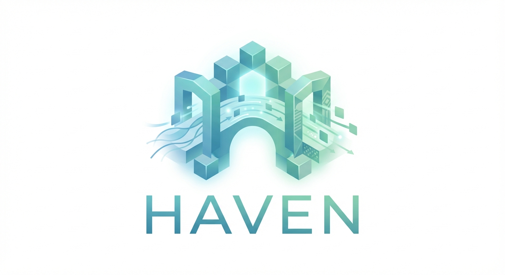

  

# HAVEN Protocol

**Health Asset Value & Exchange Network**

A value exchange protocol for patient-controlled health data.

---

## Overview

HAVEN defines four core primitives for patient data sovereignty:

| Primitive | Description |
|-----------|-------------|
| **Health Asset** | Content-addressed governed data objects |
| **Consent Protocol** | Programmable authorization with deterministic evaluation |
| **Provenance Record** | Hash-chained audit trail |
| **Contribution Model** | Quality-weighted value quantification |

HAVEN builds on established standards (HL7 FHIR R4, OHDSI OMOP CDM) and leaves implementation choices to adopters.

## Documentation

| Document | Description |
|----------|-------------|
| [Whitepaper (English)](docs/WHITEPAPER.md) | Full protocol specification |
| [Whitepaper (中文)](docs/WHITEPAPER_ZH.md) | 协议规范中文版 |
| [Whitepaper (Français)](docs/WHITEPAPER_FR.md) | Spécification du protocole |
| [Implementation Guide](docs/implementation-guide.md) | How to build HAVEN-compliant systems |
| [Formal Specifications](spec/) | RFC-style specs for each primitive |

## Related Projects

- **[PSDL](https://github.com/Chesterguan/PSDL)** - Patient Scenario Definition Language, the recommended policy language for HAVEN

## Core Principles

1. **Patient-Native Sovereignty** - Patient control is the foundation, not a feature
2. **Programmable Governance** - Consent is policy to execute, not form to sign
3. **Auditable by Default** - Every access creates a record
4. **Contribution Quantification** - Patient value is measurable
5. **Regulatory Compatibility** - Enables compliance, doesn't replace it
6. **Implementation Agnostic** - Protocol works across storage, compute, UI choices

## Standards

HAVEN builds on:

- **FHIR R4** - Data exchange format
- **OMOP CDM** - Research data model
- **SMART on FHIR** - Authorization framework
- **OAuth 2.0 / OIDC** - Authentication

## License

This work is licensed under [Creative Commons Attribution 4.0 International (CC BY 4.0)](LICENSE).

## Contact

- **Email**: chesterguan@prometheno.org
- **Project**: [Prometheno](https://github.com/Prometheno)

---

*HAVEN Protocol v2.0 | February 2026*
