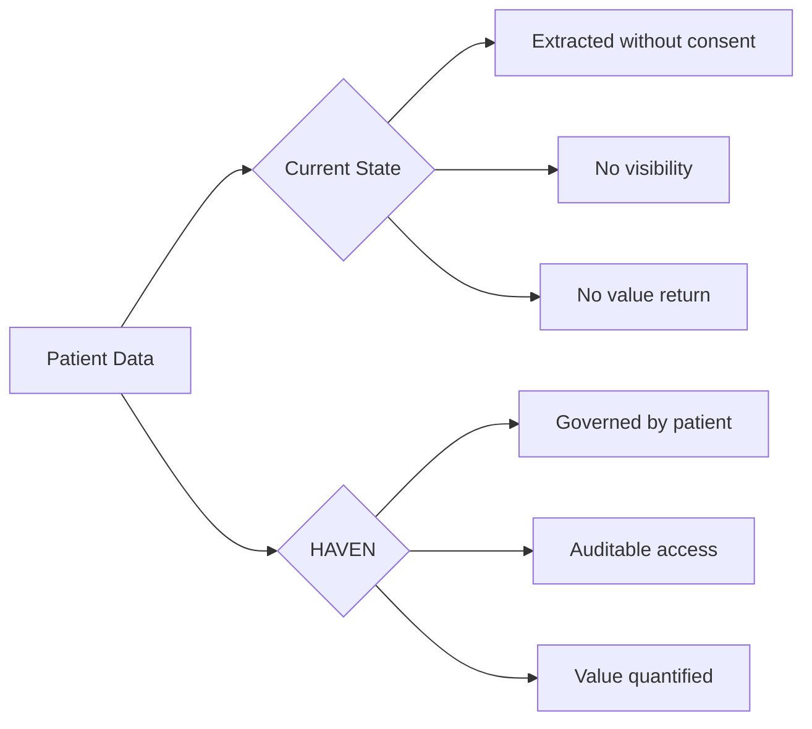
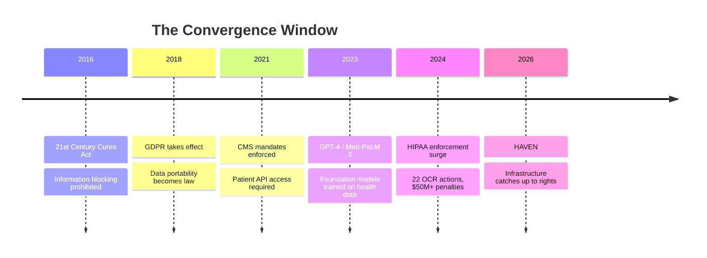
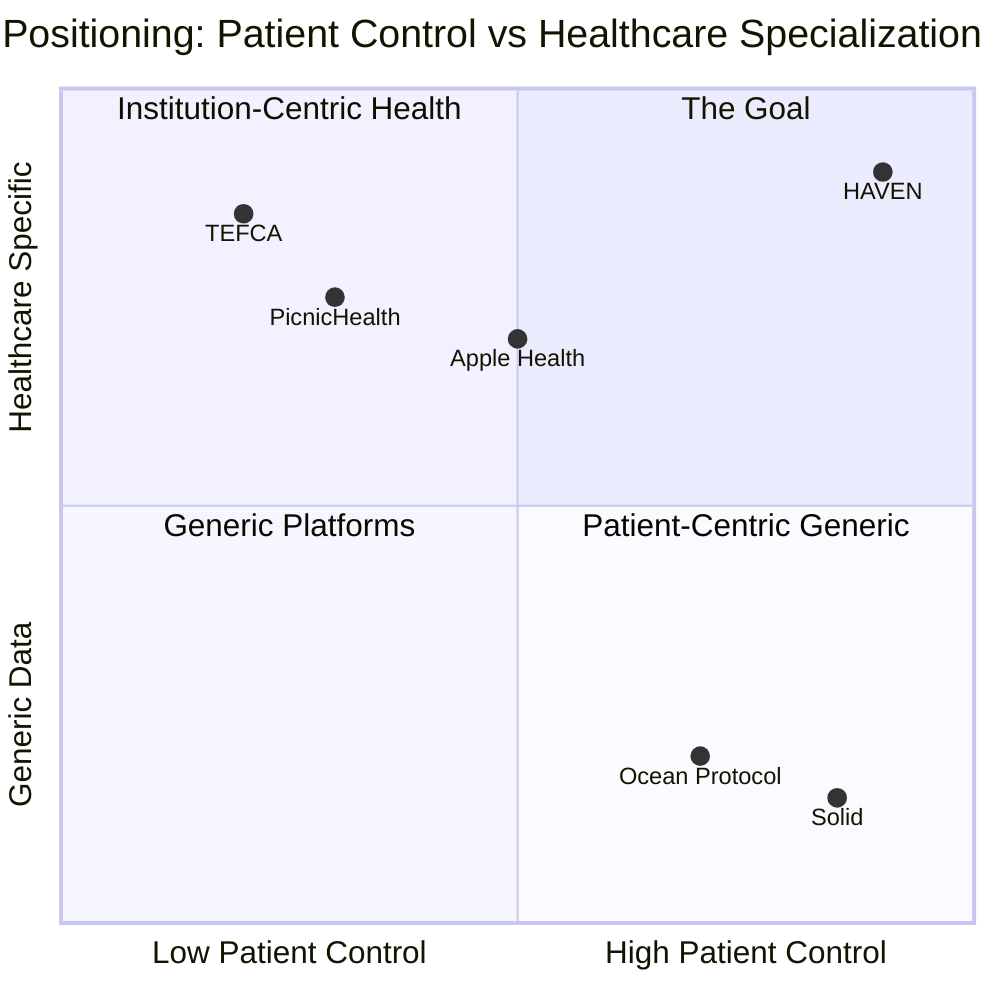
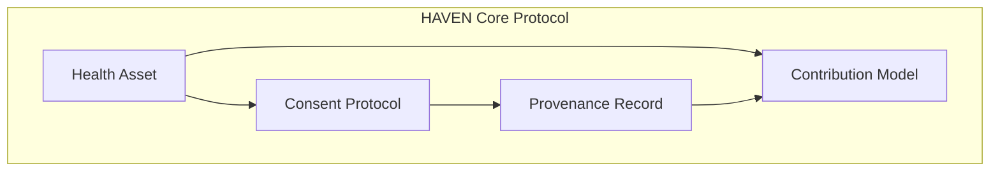
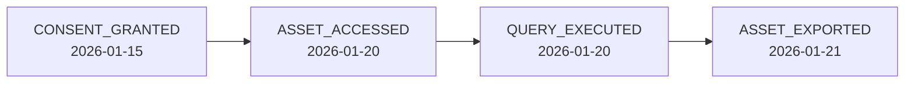
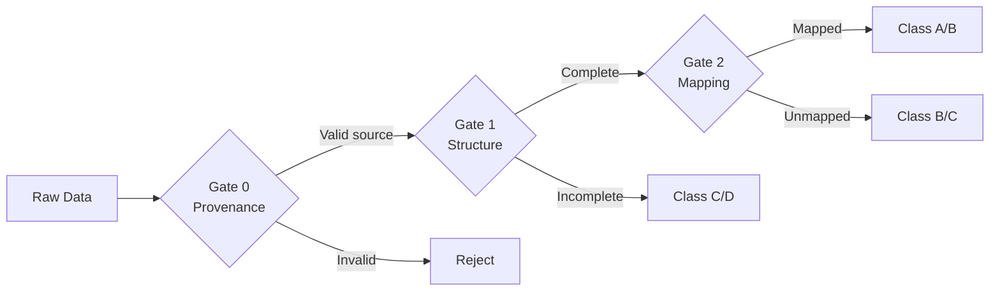
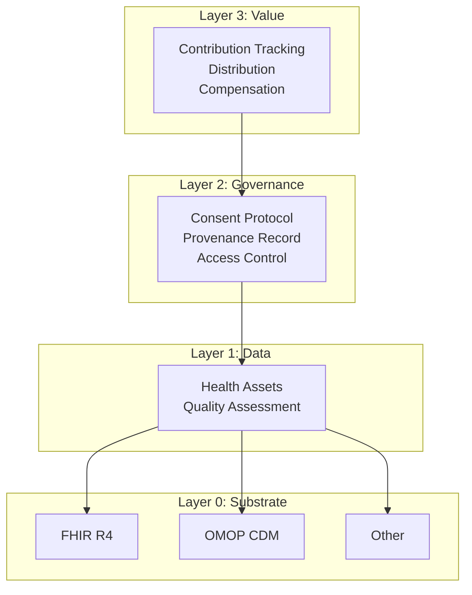
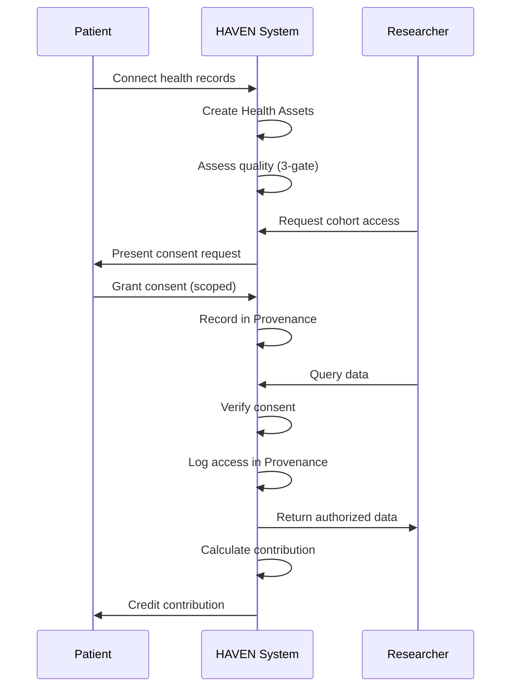

# HAVEN: A Value Exchange Protocol for Patient Health Data

**Version 2.0 | February 2026**

---

## Abstract

HAVEN is a protocol for patient-controlled health data. It specifies how data gets referenced, consented, audited, and valued. It says nothing about how you store data, run computations, or handle payments.

The protocol has four parts:
- **Health Assets**: Smart pointers to clinical data with built-in governance
- **Consent Protocol**: Machine-executable authorization that patients actually control
- **Provenance Record**: An audit trail nobody can tamper with
- **Contribution Model**: A way to measure what patient data is worth

We build on FHIR and OMOP because they already work. We leave storage, compute, and economics to implementers because one size won't fit all.

This document explains what HAVEN specifies—and what it deliberately leaves open.

---

## Table of Contents

1. [Introduction](#1-introduction)
2. [Why Now](#2-why-now)
3. [Related Work](#3-related-work)
4. [Problem Statement](#4-problem-statement)
5. [Design Principles](#5-design-principles)
6. [HAVEN Core Protocol](#6-haven-core-protocol)
7. [Reference Architecture](#7-reference-architecture)
8. [Foundations](#8-foundations)
9. [Implementation Scope](#9-implementation-scope)
10. [Conclusion](#10-conclusion)

---

## 1. Introduction

Every blood test, imaging scan, and clinical note you generate becomes training data for AI systems you'll never see. Foundation models are learning medicine from patient records—often exceeding human specialists in narrow tasks—while the people whose bodies produced that data have no say in how it's used.

Here's what that looks like in practice: **you can't see who accessed your records, you can't control what they do with them, and you certainly don't share in the billions of dollars your data helps generate.**

Shoshana Zuboff calls this "surveillance capitalism"—human experience extracted as free raw material [18]. Jaron Lanier puts it more bluntly: patients perform valuable labor every time they seek care, but the wealth flows elsewhere [19].

Three centuries ago, John Locke argued that people own the fruits of their labor [20]. If you generate health data through the work of living—managing chronic illness, showing up for appointments, tolerating the indignities of medical care—shouldn't you have some say in what happens to it?

HAVEN starts from a simple premise: **patient sovereignty isn't a feature to add later. It's the foundation.**



You won't download HAVEN from an app store. It's a protocol—specifications that let different systems work together while keeping patients in control.

---

## 2. Why Now

Patient data sovereignty has been technically impossible for most of modern healthcare. That changed.



### 2.1 The Infrastructure Finally Exists

Ten years ago, building this would have required convincing every hospital to adopt new standards. Today:

| Component | Status | Significance |
|-----------|--------|--------------|
| FHIR R4 | Widely adopted | Standard API for health data exchange |
| SMART on FHIR | Widely adopted [1] | Patient-authorized OAuth 2.0 access |
| OMOP CDM | 974M patient records [2] | Research-ready common data model |
| CMS Mandates | Enforced since 2021 | Legal right to electronic health data |

Previous attempts failed because infrastructure didn't exist:
- **Microsoft HealthVault (2007-2019)**: Shut down due to low adoption [3]
- **Google Health 1.0 (2008-2012)**: Discontinued, cited lack of widespread use [4]

The difference now: **standards are mandated, not optional**.

### 2.2 AI Isn't Waiting

While we debate patient rights, foundation models are already training on health data:

- **GPT-4** trained on undisclosed medical corpora with no patient consent mechanism [5]
- **Med-PaLM 2** achieved 86.5% on MedQA, trained on clinical datasets [6]
- **PubMed** contains 36M+ articles, increasingly used for medical AI training [7]

Meanwhile, clinical trials—an $84B industry heading toward $158B by 2033 [8]—are drowning in their own inefficiency:

| Problem | Data |
|---------|------|
| Trial recruitment failure | 80% of trials fail to meet enrollment timelines [9] |
| Cost per patient | $6,533 average recruitment cost per patient [10] |
| Data acquisition time | 6-18 months for retrospective data access [11] |
| Screen failure rate | 25-50% of screened patients fail eligibility [12] |

**The window is closing.** Once models are trained on ungoverned data, provenance is permanently lost.

### 2.3 Regulators Are Done Waiting

| Regulation | Year | Impact |
|------------|------|--------|
| 21st Century Cures Act | 2016 | Information blocking prohibited; $1M+ penalties |
| CMS Interoperability Rules | 2021 | Patient access to claims data mandated |
| GDPR Article 20 [17] | 2018 | Data portability as fundamental right |
| HIPAA Right of Access [16] | 2019 | 30-day response requirement; OCR enforcement |

2024 enforcement: **HHS OCR issued 22 HIPAA enforcement actions**, with over 50 Right of Access penalties since 2019 [13].

The legal framework for patient control is arriving faster than the technical infrastructure to support it. HAVEN fills that gap.

---

## 3. Related Work

Others have tried to solve this problem. Here's why we think they fell short—and what HAVEN does differently.

| Approach | Focus | HAVEN Differentiation |
|----------|-------|----------------------|
| **Apple Health Records** | Consumer aggregation via SMART on FHIR | Aggregation only; no consent protocol, no research marketplace, no contribution tracking |
| **PicnicHealth** | Medical record collection for research | Centralized platform; patients don't control governance, consent is binary |
| **Ocean Protocol** | Decentralized data marketplace | Generic data focus; no health-specific standards (FHIR/OMOP), no clinical consent semantics |
| **Solid (Tim Berners-Lee)** | Personal data pods | General-purpose; no health data model, no quality assessment, no research workflow |
| **CommonHealth (Android)** | Health data API standard | Device-level API; no consent protocol, no provenance, no value model |
| **TEFCA/Carequality** | Network-to-network exchange | Institution-centric; patient is not the data controller |

#### Capability Comparison

|  | Patient Control | Consent Granularity | Audit Trail | Value Tracking | Health Standards | Research Ready |
|--|:--:|:--:|:--:|:--:|:--:|:--:|
| **HAVEN** | ●●●● | ●●●● | ●●●● | ●●●● | ●●●● | ●●●● |
| Apple Health | ●●○○ | ●○○○ | ●○○○ | ○○○○ | ●●●○ | ○○○○ |
| PicnicHealth | ●○○○ | ●○○○ | ●●○○ | ●○○○ | ●●●○ | ●●●○ |
| Ocean Protocol | ●●●○ | ●●○○ | ●●●○ | ●●●○ | ○○○○ | ●○○○ |
| Solid | ●●●● | ●●○○ | ●●○○ | ○○○○ | ○○○○ | ○○○○ |
| TEFCA | ●○○○ | ●○○○ | ●●○○ | ○○○○ | ●●●● | ●●○○ |



**Where HAVEN fits**: We took Solid's idea (patients own their data) and made it work for healthcare. That means speaking FHIR and OMOP, handling the weird consent requirements that health data needs, and tracking quality in ways researchers actually care about.

This isn't an app you download. It's plumbing that lets different apps work together without anyone losing control of their data.

---

## 4. Problem Statement

Modern health IT solved interoperability. It forgot about the patient. Four failures persist:

| Problem | Description | HAVEN Response |
|---------|-------------|----------------|
| **Interoperability without governance** | Data flows between systems; consent does not | Health Assets embed governance |
| **Static consent** | Binary, coarse, permanent | Consent Protocol: dynamic, granular, revocable |
| **No audit trail** | Usage invisible to patients | Provenance Record: append-only log |
| **Value extraction** | Patients excluded from value | Contribution Model: quantified, transparent |

---

## 5. Design Principles

We made choices. Here's what we believe:

**Patient control comes first.** Not as a feature we'll add later, but as the architectural foundation. Everything else follows from this.

**Consent should be code, not paperwork.** A signed form sitting in a filing cabinet doesn't help anyone. Consent needs to be machine-readable, machine-enforceable, and revocable in real-time.

**Every access leaves a trace.** No silent reads. No invisible queries. If someone touches the data, that fact gets recorded.

**Patient value should be measurable.** If data has worth, we should be able to quantify who contributed what.

**Work with regulators, not around them.** HAVEN helps you comply with HIPAA and GDPR. It doesn't replace legal requirements—it makes them easier to meet.

**No technology lock-in.** Use whatever database you want. Deploy wherever you want. The protocol doesn't care.

These aren't novel ideas. Beauchamp and Childress laid out the ethical framework in 1979: **autonomy**, **beneficence**, **non-maleficence**, **justice** [21]. HAVEN just takes those principles and makes them technical requirements:

| HAVEN Principle | Ethical Foundation |
|-----------------|-------------------|
| Patient-Native Sovereignty | **Autonomy**: respect for patient self-determination |
| Auditable by Default | **Non-maleficence**: prevent hidden harms through transparency |
| Contribution Quantification | **Justice**: fair distribution of benefits and burdens |
| Regulatory Compatibility | **Beneficence**: enable good outcomes within legal frameworks |

Lawrence Lessig put it simply: "code is law" [22]. The technical choices we make encode values whether we admit it or not. HAVEN explicitly chooses patient sovereignty. It's not a constraint we work around—it's the point.

---

## 6. HAVEN Core Protocol

HAVEN is deliberately minimal. Four primitives, tightly specified. Everything else—how you store data, run computations, handle payments—is your problem to solve.



**How they connect:**
- Every **Health Asset** requires a **Consent** reference (no "naked" data)
- Every **Consent** operation creates a **Provenance** entry (audit trail)
- **Contribution** calculates value from **Assets** using **Provenance** for attribution

### 6.1 Health Asset

Think of a Health Asset as a "smart pointer" to clinical data. It's not the data itself—it's a reference that carries its own governance rules. You can't touch the underlying data without going through the consent and audit machinery attached to the asset.

#### Specification

```
HealthAsset := {
    asset_id        : ContentHash      // Derived from content
    data_ref        : SecureReference  // Pointer to clinical data
    substrate       : Identifier       // Data format (FHIR, OMOP, etc.)
    consent_ref     : ConsentID        // Active consent policy
    quality_class   : {A, B, C, D}     // Data quality grade
    provenance_ref  : ProvenanceID     // Audit chain reference
    patient_ref     : PatientID        // Owner of this data
    created_at      : Timestamp
}
```

#### What Makes It Work

You can't create a Health Asset without a consent reference. The protocol rejects it. This isn't a policy choice—it's enforced at the data structure level.

The `asset_id` comes from hashing the content (SHA-256), so if anyone tampers with the data, the ID won't match. Same trick Git uses. The asset can live in FHIR, OMOP, or whatever format your system needs—semantic mappings handle the translation. And every asset gets a quality grade (A through D) based on how well it passes the validation gates.

#### Example

```json
{
  "asset_id": "sha256:a1b2c3...",
  "data_ref": "omop://person/12345/measurement/67890",
  "substrate": "OMOP-CDM-6.0",
  "consent_ref": "consent:98765",
  "quality_class": "A",
  "provenance_ref": "prov:chain:11111",
  "patient_ref": "patient:alice-12345",
  "created_at": "2026-01-15T10:30:00Z"
}
```

---

### 6.2 Consent Protocol

Today's consent is a fiction: you sign a 40-page form you didn't read, granting permanent rights you can't revoke, to data uses you'll never know about. HAVEN's Consent Protocol turns consent into something that actually works.

#### Specification

```
ConsentAttestation := {
    consent_id      : UUID
    grantor         : PatientIdentity   // Who grants
    grantee         : AccessorIdentity  // Who receives
    scope           : DataScope         // What data
    purpose         : PurposeType       // Why
    conditions      : Conditions[]      // Under what rules
    granted_at      : Timestamp
    expires_at      : Timestamp | null
    status          : {active, revoked, expired}
    signature       : CryptoSignature
}

DataScope := {
    resource_types  : ResourceType[]    // Conditions, Labs, Meds, etc.
    time_range      : TimeRange | null  // Historical bounds
    exclusions      : ResourceType[]    // Explicitly excluded
}
```

#### Operations

| Operation | Description |
|-----------|-------------|
| `grant()` | Create new consent attestation |
| `verify()` | Check if access is authorized |
| `revoke()` | Withdraw consent (immediate) |
| `list()` | View all consents (for patient transparency) |

#### Example: Research Consent

```yaml
consent:
  grantor: "patient:alice"
  grantee: "study:diabetes-cgm-2026"
  scope:
    resource_types: [Measurement, Condition, DrugExposure]
    time_range: {start: "2020-01-01", end: null}
    exclusions: [Note, Observation.mental_health]
  purpose: "RESEARCH"
  conditions:
    - type: "AGGREGATION_ONLY"
      min_cohort_size: 50
    - type: "NO_REIDENTIFICATION"
  expires_at: "2027-01-15"
```

**What patient sees**: "I'm sharing my labs, conditions, and medications (but not mental health notes) with the Diabetes CGM Study. They can only use it in aggregate with 50+ other patients. This expires in one year. I can revoke anytime."

#### What the Protocol Guarantees

Run the same consent check twice with the same inputs—you get the same answer. No randomness, no "it depends." This matters for auditing.

When a patient revokes consent, it's immediate. Not "within 24 hours" or "after the next sync." The next `verify()` call returns denied. Done.

And we use closed-world semantics: if you didn't explicitly grant access to a resource type, the answer is no. Silence means denial, not permission.

#### Why This Matters

We didn't invent these ideas. After Nazi medical experiments, the Nuremberg Code (1947) established that voluntary consent isn't optional—it's the ethical foundation [23]. The Belmont Report (1979) codified this for modern research [24]. We're just making these principles executable.

Helen Nissenbaum's "contextual integrity" framework explains why current consent fails [25]: information that's appropriate in one context (sharing symptoms with your doctor) becomes a violation when it flows to another (that data training an advertising model). HAVEN enforces context. Data shared for research stays in research. Period.

#### PSDL: A Declarative Policy Language (Optional)

HAVEN recommends **[PSDL](https://github.com/Chesterguan/PSDL)** (Patient Scenario Definition Language) for consent policies and clinical scenarios. PSDL is **optional but recommended** for implementations that want human-readable, machine-executable authorization logic.

**Why PSDL?** Instead of opaque algorithms, patients can understand their consent:
- *"This shares my lab data with the Diabetes Study"*
- *"They can only use it in aggregate with 50+ other patients"*
- *"It's based on the ADA clinical guidelines"*

Same inputs, same outputs, every time—and you can trace exactly why a decision was made. See [Appendix C: PSDL Reference](#appendix-c-psdl-reference) for how it works.

---

### 6.3 Provenance Record

Right now, you have no idea who looked at your medical records last Tuesday. The Provenance Record fixes that—an append-only log of every access, every query, every export. Nobody can erase their tracks.

#### Specification

```
ProvenanceEntry := {
    entry_id        : UUID
    timestamp       : Timestamp
    event_type      : EventType
    actor           : Identity
    subject         : AssetRef | ConsentRef
    details         : EventData
    previous_hash   : Hash          // Chain linkage
    signature       : CryptoSignature
}

EventType := {
    ASSET_CREATED, ASSET_ACCESSED, ASSET_EXPORTED,
    CONSENT_GRANTED, CONSENT_VERIFIED, CONSENT_REVOKED,
    QUERY_EXECUTED, COMPUTATION_RUN
}
```

#### How It Stays Honest

Once an entry goes in, it stays. No edits, no deletions. Each entry includes the hash of the previous one, so tampering with history breaks the chain—you'd have to rewrite everything that came after. (Yes, like a blockchain, but without the consensus theater.)

Every entry gets signed. Ed25519 or ECDSA, take your pick. The signature ties each action to a specific actor, and patients can pull their complete history through an authenticated API. Verification is O(log n)—you don't need to replay the whole chain to check a single entry.

#### Example: Access Log



```json
{
  "entry_id": "prov:entry:555",
  "timestamp": "2026-01-20T14:30:00Z",
  "event_type": "ASSET_ACCESSED",
  "actor": "researcher:bob@stanford.edu",
  "subject": "asset:a1b2c3",
  "details": {
    "consent_ref": "consent:98765",
    "purpose": "diabetes-cgm-study",
    "access_type": "READ"
  },
  "previous_hash": "sha256:prev...",
  "signature": "sig:..."
}
```

---

### 6.4 Contribution Model

If patient data has value—and it clearly does, given the billions flowing through the health data economy—then patients should see some of it. The Contribution Model creates the accounting system to make that possible.

#### Specification

```
Contribution := {
    patient_id      : PatientIdentity
    asset_refs      : AssetRef[]
    quality_score   : Float[0, 1]
    tier            : ContributionTier
    context         : UsageContext      // Study, query, etc.
    timestamp       : Timestamp
}

ContributionTier := {
    PROFILE,        // Demographics, basic info
    STRUCTURED,     // Labs, meds, conditions
    LONGITUDINAL,   // Multi-year records
    COMPLEX         // Notes, imaging, genomics
}
```

#### Quality Assessment

HAVEN defines a three-gate quality protocol:



| Gate | Checks | Failure Result |
|------|--------|----------------|
| Gate 0: Provenance | Valid source, hash integrity | Rejected |
| Gate 1: Structure | Required fields, valid codes | Class C/D |
| Gate 2: Mapping | Standard concepts, research-ready | Class B/C |

#### Quality Score Computation

Each gate contributes to a composite quality score:

```
QualityScore = G₀ × (w₁·G₁ + w₂·G₂)

Where:
  G₀ = Provenance gate (binary: 0 or 1)
  G₁ = Structure completeness (0.0 to 1.0)
  G₂ = Concept mapping coverage (0.0 to 1.0)
  w₁ = 0.4 (structure weight)
  w₂ = 0.6 (mapping weight)
```

The quality class follows from the score:

| Quality Score | Class | Meaning |
|---------------|-------|---------|
| ≥ 0.90 | A | Research-grade, fully mapped |
| 0.75 – 0.89 | B | Good quality, minor gaps |
| 0.50 – 0.74 | C | Usable with caveats |
| < 0.50 | D | Limited utility |

If G₀ = 0 (provenance fails), the asset is rejected entirely—no score assigned.

#### Example: Contribution Calculation

```
Patient Alice contributes to Study X:
  - 3 years of lab data (LONGITUDINAL tier)
  - Quality Class A (passed all gates)
  - 847 measurements, 23 conditions

Contribution Score = TierWeight × QualityScore × VolumeNorm
                   = 1.0 × 0.95 × 0.87
                   = 0.83
```

The score (0.0 to 1.0) is a relative weight, not a dollar amount. If Alice scores 0.83 and Bob scores 0.41, Alice contributed roughly twice as much to that study. What that means in actual money? That's between you, your users, and your business model.

The weights we provide are starting points. A genomics study might value COMPLEX tier data differently than a population health survey. Adjust accordingly.

#### The Harder Question: What's Fair?

Dividing value fairly when many people contribute is genuinely hard. Rawls argued that inequalities only make sense if they help the worst-off [26]. In health data terms: patients bear the real risks (privacy, discrimination, insurance consequences). They should share the real benefits.

Elinor Ostrom won a Nobel Prize showing that communities can govern shared resources without either privatizing them or handing them to the state [27]. Patient data fits this model: a **governed commons**. Not locked away (that helps no one). Not extracted freely (that helps everyone but patients). Collectively managed, through consent and transparent accounting.

---

## 7. Reference Architecture

You can build HAVEN-compliant systems many ways: centralized data lakes, federated networks, compute-to-data architectures where queries travel instead of data. We don't care. The protocol specifies the data structures and semantics—how you deploy them is your business.

Here's one way to think about the layers (but don't treat this as gospel):



### Data Flow Example

One way this could work (yours might look different—maybe the data stays encrypted and only the patient can unlock it, or queries travel to the data instead of the other way around):



---

## 8. Foundations

We're not inventing new standards. Healthcare already has too many of those. HAVEN rides on what already works:

| Foundation | Role in HAVEN | Adoption Scale |
|------------|---------------|----------------|
| **FHIR R4** | Data exchange format | Mandated by CMS; supported by Epic, Cerner, all major EHRs [14] |
| **OMOP CDM** | Research data model | 974M patient records across 544 databases in 54 countries [2][15] |
| **SMART on FHIR** | Authorization framework | Major EHRs (Epic, Cerner, Allscripts); Apple Health Records integration [1] |
| **OAuth 2.0 / OIDC** | Authentication | Industry standard; 1B+ daily authentications globally |
| **Content-addressable storage** | Asset integrity | Proven in Git (100M+ repos), IPFS, blockchain systems |

### Technical Foundation Details

**OMOP Vocabulary Coverage:**
- 270,000+ standard concepts across 100+ vocabularies
- ICD-10 → SNOMED-CT mappings for 95%+ of diagnosis codes
- RxNorm coverage for 99%+ of US prescription medications
- LOINC mappings for laboratory observations

**FHIR R4 Resource Types:**
HAVEN Health Assets map to FHIR resources including: `Patient`, `Condition`, `Observation`, `MedicationRequest`, `Procedure`, `DiagnosticReport`, `DocumentReference`.

### Why This Matters

Healthcare doesn't need another proprietary format that forces everyone to rip out their existing systems. HAVEN plugs into what's already there—your Epic instance, your OMOP warehouse, your existing authentication. The standards have institutional buy-in and regulatory backing. You're not waiting for research breakthroughs; this is integration engineering. And with 330+ databases already speaking OMOP, you're not starting from scratch.

---

## 9. Implementation Scope

We're opinionated about some things and deliberately silent on others. Here's where the line is.

### HAVEN Specifies

| Component | Specification |
|-----------|---------------|
| Health Asset structure | Required fields, content addressing, quality grades |
| Consent Protocol | Operations, attestation format, verification algorithm |
| Provenance Record | Event types, hash chaining, Merkle proofs |
| Contribution Model | Tiers, quality gates, value calculation formula |
| Exchange Bundle | Interoperability format for data transfer |

**Note**: The four primitives (Health Asset, Consent, Provenance, Contribution) form the core protocol. The Exchange Bundle is supporting infrastructure for transferring data between HAVEN-compliant systems.

### Implementations Decide

| Choice | Options | HAVEN Position |
|--------|---------|----------------|
| **Data substrate** | FHIR, OMOP, MEDS, custom | Any standards-compliant format |
| **Storage** | PostgreSQL, MongoDB, blockchain | Protocol-agnostic |
| **Compute model** | Centralized, federated, enclave | All valid if consent enforced |
| **User interface** | Mobile app, web, API-only | Not specified |
| **Payment rails** | Fiat, crypto, points | Implementation choice |
| **Data ingestion** | Fasten, 1upHealth, direct EHR | Any compliant source |
| **Encryption** | AES, ChaCha20, etc. | Implementation choice |
| **Key management** | Custodial, self-sovereign, social recovery | Implementation choice |
| **Identity verification** | KYC, DID, OAuth, etc. | Implementation choice |

### Economics: Intentionally Open

We know how to measure contribution. We're not going to tell you how to pay for it.

HAVEN provides the accounting: `Value = TierWeight × QualityScore × VolumeNorm`. Reference weights and quality thresholds are in the spec. But payment rails? Marketplace design? Token economics? Those are yours to figure out.

This isn't a cop-out. It's recognition that the right economic model depends on context—academic research, commercial trials, and patient advocacy groups will need different approaches. HAVEN gives them a common language for value; they decide what to do with it.

### What This Means

A HAVEN-compliant system:

- ✅ MUST implement Health Asset, Consent, Provenance, Contribution primitives
- ✅ MUST enforce consent verification before data access
- ✅ MUST maintain append-only provenance records
- ✅ MUST support Exchange Bundle format for interoperability
- ⚪ MAY use any storage, compute, or UI approach
- ⚪ MAY implement any economic distribution model
- ⚪ MAY extend the protocol with additional features

### Optional Extensions

- **PSDL** (Patient Scenario Definition Language): Declarative policy language for consent and clinical scenarios. Recommended but not required. See [github.com/Chesterguan/PSDL](https://github.com/Chesterguan/PSDL).

### What We're Not Trying to Do

Scope creep kills protocols. Here's what HAVEN deliberately ignores:

- **Compliance**: HAVEN helps you comply with HIPAA/GDPR. It doesn't replace your lawyers.
- **Marketplaces**: We measure value. We don't build payment systems.
- **User interfaces**: How patients and researchers interact? Your problem.
- **New data formats**: We use FHIR and OMOP. We're not inventing another standard.
- **Technology choices**: No blockchain requirement. No cloud vendor lock-in. No opinions on your database.
- **Identity**: How you verify patients are who they say they are is up to you.

---

## 10. Conclusion

The deal patients get today is bad: generate the data, bear the risks, see none of the value. HAVEN doesn't fix this through better intentions or tighter regulation. It fixes it through infrastructure.

Four primitives. That's the entire protocol: Health Asset, Consent Protocol, Provenance Record, Contribution Model. Enough to make patient sovereignty technically enforceable. Not enough to lock anyone into a particular implementation.

The timing matters. FHIR and OMOP are mandated or widely adopted. Foundation models are being trained on health data right now. Regulators are enforcing patient access rights with real penalties. The window for building this infrastructure is open—but it won't stay open forever.

---

We're building a reference implementation to prove this works. If you're interested in patient-sovereign health data, reach out.

**Contact**: chesterguan@prometheno.org

---

## References

[1] Mandel, J.C., et al. "SMART on FHIR: A standards-based, interoperable apps platform for electronic health records." *Journal of the American Medical Informatics Association* 23.5 (2016): 899-908.

[2] OHDSI. "OHDSI Network Statistics." Observational Health Data Sciences and Informatics, 2024. https://ohdsi.org/

[3] Microsoft. "HealthVault Service Discontinuation." Microsoft Health Blog, 2019.

[4] Google. "An update on Google Health and Google PowerMeter." Official Google Blog, 2011.

[5] OpenAI. "GPT-4 Technical Report." arXiv:2303.08774, 2023.

[6] Singhal, K., et al. "Towards Expert-Level Medical Question Answering with Large Language Models." arXiv:2305.09617, 2023.

[7] National Library of Medicine. "PubMed Overview." NIH, 2024. https://pubmed.ncbi.nlm.nih.gov/

[8] Grand View Research. "Clinical Trials Market Size Report, 2024-2032." 2024.

[9] Fogel, D.B. "Factors associated with clinical trials that fail and opportunities for improving the likelihood of success." *Contemporary Clinical Trials Communications* 11 (2018): 156-164.

[10] Sertkaya, A., et al. "Key cost drivers of pharmaceutical clinical trials in the United States." *Clinical Trials* 13.2 (2016): 117-126.

[11] TriNetX. "Real-World Data Access Benchmarks." 2023.

[12] Getz, K.A. "Examining and Enabling the Role of Health Care Providers as Patient Recruitment Partners." *Clinical Therapeutics* 39.11 (2017): 2244-2249.

[13] HHS Office for Civil Rights. "HIPAA Enforcement Highlights." 2024. https://www.hhs.gov/hipaa/

[14] HL7 International. "FHIR R4 Specification." https://hl7.org/fhir/R4/

[15] OHDSI. "OMOP Common Data Model v6.0." https://ohdsi.github.io/CommonDataModel/

[16] HIPAA Privacy Rule. 45 CFR Part 160 and Part 164.

[17] GDPR. Regulation (EU) 2016/679 of the European Parliament.

[18] Zuboff, S. *The Age of Surveillance Capitalism: The Fight for a Human Future at the New Frontier of Power.* PublicAffairs, 2019.

[19] Lanier, J. *Who Owns the Future?* Simon & Schuster, 2013.

[20] Locke, J. *Two Treatises of Government.* 1689. (Chapter V: "Of Property")

[21] Beauchamp, T.L., and Childress, J.F. *Principles of Biomedical Ethics.* 8th ed., Oxford University Press, 2019. (Originally published 1979)

[22] Lessig, L. *Code: Version 2.0.* Basic Books, 2006.

[23] "The Nuremberg Code." *Trials of War Criminals before the Nuremberg Military Tribunals.* U.S. Government Printing Office, 1949. (Originally issued 1947)

[24] National Commission for the Protection of Human Subjects of Biomedical and Behavioral Research. *The Belmont Report: Ethical Principles and Guidelines for the Protection of Human Subjects of Research.* U.S. Department of Health, Education, and Welfare, 1979.

[25] Nissenbaum, H. "Privacy as Contextual Integrity." *Washington Law Review* 79.1 (2004): 119-158.

[26] Rawls, J. *A Theory of Justice.* Harvard University Press, 1971.

[27] Ostrom, E. *Governing the Commons: The Evolution of Institutions for Collective Action.* Cambridge University Press, 1990.

---

## Appendix A: Glossary

| Term | Definition |
|------|------------|
| Health Asset | Patient data object with governance metadata |
| Consent Attestation | Signed authorization record |
| Provenance Record | Append-only audit trail |
| Contribution | Quantified patient data value |
| Quality Class | A/B/C/D data quality grade |
| Substrate | Underlying data format (FHIR, OMOP, etc.) |

---

## Appendix B: Security Considerations (Non-normative)

HAVEN implementations should address the following threat categories:

| Threat | Description |
|--------|-------------|
| **Unauthorized Access** | Bypassing Consent Protocol to access data directly |
| **Provenance Tampering** | Modifying or deleting audit trail entries |
| **Incentive Gaming** | Fabricating quality scores or contribution metrics |
| **Re-identification** | Inferring individual identity from aggregated data |
| **Consent Scope Creep** | Exploiting overly broad consent grants |

Specific mitigation mechanisms are implementation-defined. Implementations are encouraged to:

- Use cryptographic signatures for all consent attestations
- Implement minimum aggregation thresholds for queries
- Employ hash-chaining for provenance integrity
- Conduct regular audits of access patterns

This appendix is non-normative. Security requirements may vary by jurisdiction and use case.

---

## Appendix C: PSDL Reference

**Repository**: https://github.com/Chesterguan/PSDL

PSDL (Patient Scenario Definition Language) is a declarative language for specifying clinical scenarios, consent policies, and data access patterns.

### Basic Structure

```yaml
scenario: <scenario_name>
version: "<semver>"

# Audit block - explains intent and evidence
audit:
  intent: "What this scenario detects"
  rationale: "Why this detection matters"
  provenance: "Clinical guideline or research source"

# Signals - bind clinical data references
signals:
  <signal_name>:
    ref: <clinical_concept>       # e.g., creatinine, glucose, heart_rate
    concept_id: <omop_id>         # OMOP standard concept ID
    unit: <unit_of_measure>       # e.g., mg/dL, mmol/L

# Trends - compute temporal features
trends:
  <trend_name>:
    expr: <temporal_expression>
    description: "Human-readable explanation"

# Logic - define detection rules
logic:
  <rule_name>:
    when: <boolean_expression>
    severity: low | medium | high
    description: "What this rule detects"

# Population (optional) - patient inclusion criteria
population:
  age: "<condition>"              # e.g., ">= 18"
  conditions: [<condition_list>]  # e.g., [diabetes, hypertension]
```

### Temporal Operators

| Operator | Syntax | Description |
|----------|--------|-------------|
| `delta` | `delta(signal, window)` | Change over time window |
| `slope` | `slope(signal, window)` | Linear trend direction |
| `ema` | `ema(signal, window)` | Exponential moving average |
| `last` | `last(signal)` | Most recent value |
| `min` | `min(signal, window)` | Minimum in window |
| `max` | `max(signal, window)` | Maximum in window |
| `count` | `count(signal, window)` | Number of observations |

**Window formats**: `30s`, `6h`, `24h`, `7d`, `30d`, `1y`

### Example: Diabetes Research Cohort

```yaml
scenario: T2DM_CGM_Cohort
version: "1.0.0"

audit:
  intent: "Identify Type 2 Diabetes patients suitable for CGM study"
  rationale: "CGM studies require confirmed T2DM with recent HbA1c data"
  provenance: "ADA Standards of Medical Care in Diabetes (2025)"

signals:
  HbA1c:
    ref: hemoglobin_a1c
    concept_id: 3004410
    unit: "%"

  glucose:
    ref: fasting_glucose
    concept_id: 3004501
    unit: mg/dL

population:
  age: ">= 30 AND <= 65"
  conditions: [type_2_diabetes]
  medications: [metformin]
  min_history: 365d

trends:
  hba1c_recent:
    expr: last(HbA1c)
    description: "Most recent HbA1c"

  hba1c_trend:
    expr: slope(HbA1c, 180d)
    description: "HbA1c trend over 6 months"

logic:
  eligible:
    when: hba1c_recent >= 7.0 AND hba1c_recent <= 10.0
    description: "HbA1c in target range for study"

  stable:
    when: abs(hba1c_trend) < 0.5
    description: "Relatively stable glycemic control"

  cohort_match:
    when: eligible AND stable
    description: "Matches CGM study criteria"
```

### Consent Policy Example

```yaml
scenario: Research_Consent_Policy
version: "1.0.0"

audit:
  intent: "Define data sharing permissions for diabetes research"
  rationale: "Patient-controlled, granular consent for research participation"

scope:
  grant:
    - Measurement.laboratory
    - Condition.endocrine
    - DrugExposure.antidiabetic
  deny:
    - Note.*
    - Observation.mental_health

  time_range:
    start: "2020-01-01"
    end: null  # ongoing

conditions:
  - type: AGGREGATION_ONLY
    min_cohort_size: 50
  - type: NO_REIDENTIFICATION
  - type: PURPOSE_RESTRICTED
    allowed: [RESEARCH, PUBLIC_HEALTH]

expiration: "2027-01-15"
revocable: true
```

### Execution Semantics

```
evaluate(scenario, patient_data) → {
    matched: boolean,
    triggered_rules: Rule[],
    confidence: float,
    audit_entry: ProvenanceEntry
}
```

**What you can count on:** Run the same scenario against the same data—you'll get the same result every time. Each evaluation leaves a trace in the provenance log. And scenarios can only see what they explicitly declare in their signals block; they can't go fishing through other data.

---

*HAVEN Protocol Whitepaper v2.0 | February 2026*

*This document is released under Creative Commons Attribution 4.0 International (CC BY 4.0).*
