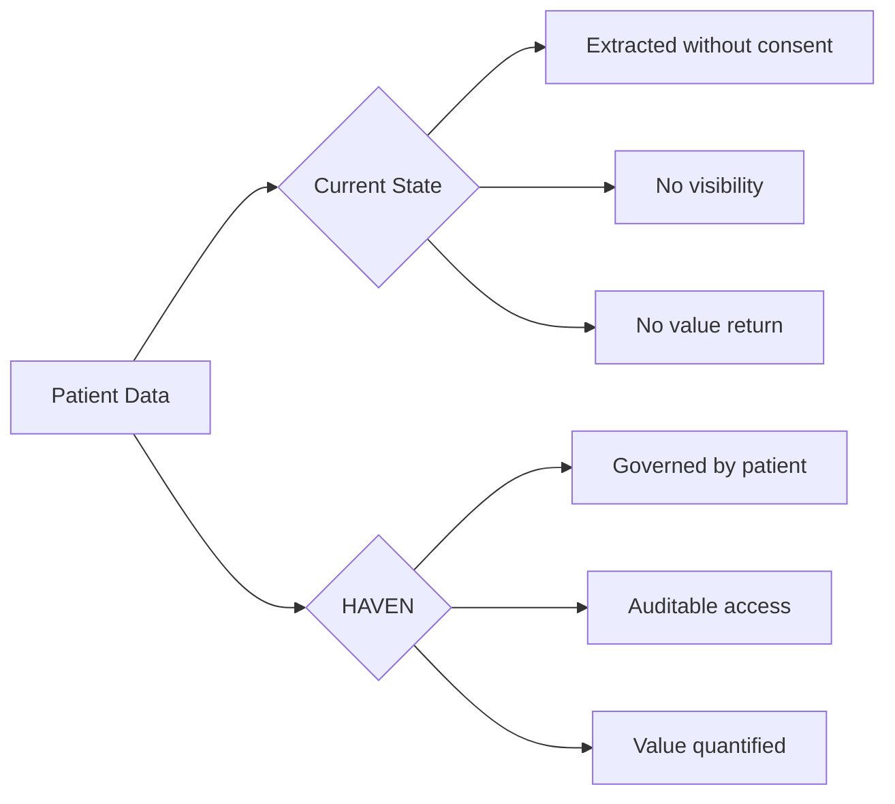
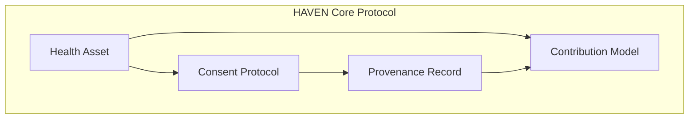
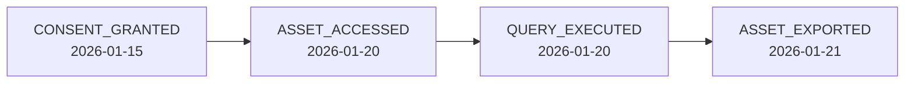
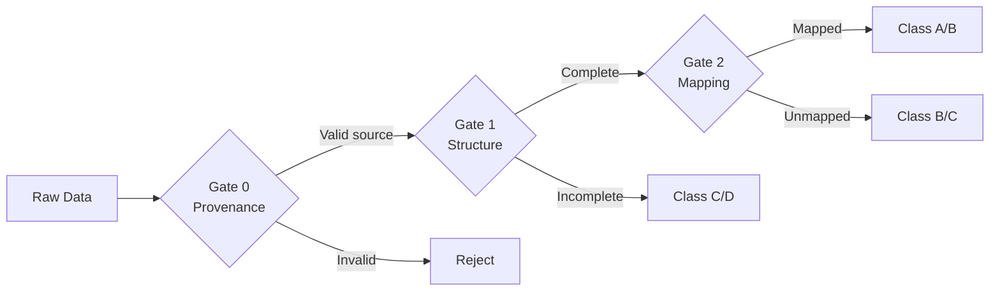
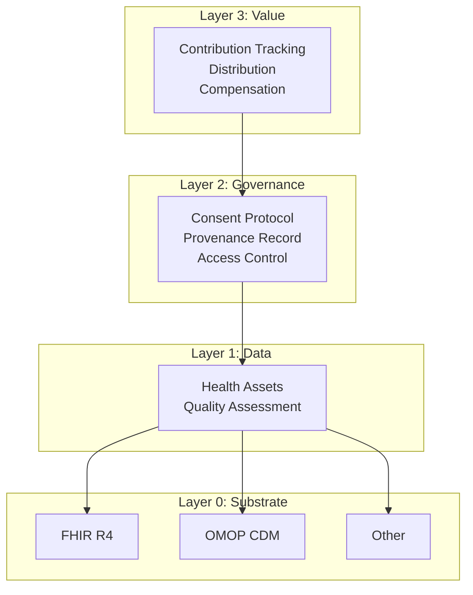
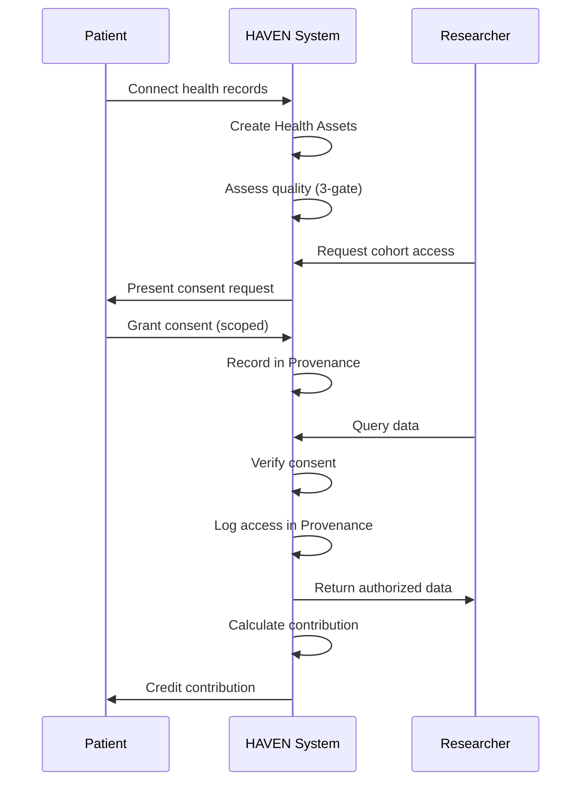

# HAVEN: A Protocol for Patient-Sovereign Health Data

**Version 2.0 | January 2026**

---

## Abstract

HAVEN (Health Asset Value & Exchange Network) is a protocol for patient-sovereign biomedical data. It defines four core primitives: **Health Assets** (content-addressed governed data objects), **Consent Protocol** (programmable authorization with deterministic evaluation), **Provenance Record** (hash-chained audit trail), and **Contribution Model** (quality-weighted value quantification).

HAVEN builds on established standards (HL7 FHIR R4, OHDSI OMOP CDM) and leaves implementation choices (storage backend, compute model, user interface) to adopters. The protocol specifies cryptographic integrity guarantees, consent verification semantics, and interoperability requirements while remaining agnostic to deployment architecture.

This whitepaper specifies what HAVEN defines and what it deliberately leaves to implementations.

---

## Table of Contents

1. [Introduction](#1-introduction)
2. [Why Now](#2-why-now)
3. [Related Work](#3-related-work)
4. [Problem Statement](#4-problem-statement)
5. [Design Principles](#5-design-principles)
6. [HAVEN Core Protocol](#6-haven-core-protocol)
7. [Reference Architecture](#7-reference-architecture)
8. [Foundations](#8-foundations)
9. [Implementation Scope](#9-implementation-scope)
10. [Conclusion](#10-conclusion)

---

## 1. Introduction

Biomedical data is becoming the primary input for AI systems that will shape medicine's future. Foundation models trained on clinical records already exceed human specialists in narrow domains.

This creates a fundamental tension: **patients who generate this data have no governance over its use, no visibility into its flow, and no participation in the value it creates.**

HAVEN proposes: **patient data sovereignty as infrastructure**.



HAVEN is not an application. It is a protocol—a set of specifications that enable patient-sovereign health data systems.

---

## 2. Why Now

Three forces converge to make patient data sovereignty both possible and urgent.

### 2.1 Infrastructure Maturity

The technical foundation now exists:

| Component | Status | Significance |
|-----------|--------|--------------|
| FHIR R4 | Widely adopted | Standard API for health data exchange |
| SMART on FHIR | Widely adopted [1] | Patient-authorized OAuth 2.0 access |
| OMOP CDM | 974M patient records [2] | Research-ready common data model |
| CMS Mandates | Enforced since 2021 | Legal right to electronic health data |

Previous attempts failed because infrastructure didn't exist:
- **Microsoft HealthVault (2007-2019)**: Shut down due to low adoption [3]
- **Google Health 1.0 (2008-2012)**: Discontinued, cited lack of widespread use [4]

The difference now: **standards are mandated, not optional**.

### 2.2 AI Creates Urgency

Foundation models are being trained on health data **now**:

- **GPT-4** trained on undisclosed medical corpora with no patient consent mechanism [5]
- **Med-PaLM 2** achieved 86.5% on MedQA, trained on clinical datasets [6]
- **PubMed** contains 36M+ articles, increasingly used for medical AI training [7]

The global clinical trials market: **$84.54B in 2024**, projected to reach **$158.41B by 2033** [8]. Yet:

| Problem | Data |
|---------|------|
| Trial recruitment failure | 80% of trials fail to meet enrollment timelines [9] |
| Cost per patient | $6,533 average recruitment cost per patient [10] |
| Data acquisition time | 6-18 months for retrospective data access [11] |
| Screen failure rate | 25-50% of screened patients fail eligibility [12] |

**The window is closing.** Once models are trained on ungoverned data, provenance is permanently lost.

### 2.3 Regulatory Momentum

| Regulation | Year | Impact |
|------------|------|--------|
| 21st Century Cures Act | 2016 | Information blocking prohibited; $1M+ penalties |
| CMS Interoperability Rules | 2021 | Patient access to claims data mandated |
| GDPR Article 20 | 2018 | Data portability as fundamental right |
| HIPAA Right of Access | 2019 | 30-day response requirement; OCR enforcement |

2024 enforcement: **HHS OCR issued 22 HIPAA enforcement actions**, with over 50 Right of Access penalties since 2019 [13].

Regulators are pushing toward patient control. HAVEN provides the technical infrastructure to implement their intent.

---

## 3. Related Work

Several approaches exist for patient health data management. HAVEN differs in scope and design philosophy.

| Approach | Focus | HAVEN Differentiation |
|----------|-------|----------------------|
| **Apple Health Records** | Consumer aggregation via SMART on FHIR | Aggregation only; no consent protocol, no research marketplace, no contribution tracking |
| **PicnicHealth** | Medical record collection for research | Centralized platform; patients don't control governance, consent is binary |
| **Ocean Protocol** | Decentralized data marketplace | Generic data focus; no health-specific standards (FHIR/OMOP), no clinical consent semantics |
| **Solid (Tim Berners-Lee)** | Personal data pods | General-purpose; no health data model, no quality assessment, no research workflow |
| **CommonHealth (Android)** | Health data API standard | Device-level API; no consent protocol, no provenance, no value model |
| **TEFCA/Carequality** | Network-to-network exchange | Institution-centric; patient is not the data controller |

**HAVEN's position**: A protocol layer that combines patient-native governance (like Solid's philosophy) with healthcare-specific standards (FHIR, OMOP) and research-ready infrastructure (consent semantics, quality scoring, contribution tracking).

HAVEN is not a platform or application—it is infrastructure that enables platforms to interoperate while preserving patient sovereignty.

---

## 4. Problem Statement

HAVEN addresses four structural failures in health data systems:

| Problem | Description | HAVEN Response |
|---------|-------------|----------------|
| **Interoperability without governance** | Data flows between systems; consent does not | Health Assets embed governance |
| **Static consent** | Binary, coarse, permanent | Consent Protocol: dynamic, granular, revocable |
| **No audit trail** | Usage invisible to patients | Provenance Record: append-only log |
| **Value extraction** | Patients excluded from value | Contribution Model: quantified, transparent |

---

## 5. Design Principles

Six principles guide HAVEN:

| Principle | Meaning |
|-----------|---------|
| **P1: Patient-Native Sovereignty** | Patient control is the foundation, not a feature |
| **P2: Programmable Governance** | Consent is policy to execute, not form to sign |
| **P3: Auditable by Default** | Every access creates a record |
| **P4: Contribution Quantification** | Patient value is measurable |
| **P5: Regulatory Compatibility** | Enables compliance, doesn't replace it |
| **P6: Implementation Agnostic** | Protocol works across storage, compute, UI choices |

---

## 6. HAVEN Core Protocol

HAVEN defines four primitives. Everything else is implementation choice.



### 6.1 Health Asset

A **Health Asset** is a governed data reference—not raw data, but a pointer with embedded governance metadata.

#### Specification

```
HealthAsset := {
    asset_id        : ContentHash      // Derived from content
    data_ref        : SecureReference  // Pointer to clinical data
    substrate       : Identifier       // Data format (FHIR, OMOP, etc.)
    consent_ref     : ConsentID        // Active consent policy
    quality_class   : {A, B, C, D}     // Data quality grade
    provenance_ref  : ProvenanceID     // Audit chain reference
    created_at      : Timestamp
}
```

#### Properties

1. **Governance-embedded**: Never "naked" data. Consent reference is required—enforced at the protocol level.
2. **Content-addressed**: `asset_id` derived via SHA-256 content hash ensures immutability and enables Merkle tree verification across distributed systems.
3. **Substrate-agnostic**: Same asset may have FHIR, OMOP, or MEDS representations with semantic equivalence maintained through concept mappings.
4. **Quality-scored**: Every asset carries a quality classification derived from the three-gate validation protocol.

#### Example

```json
{
  "asset_id": "sha256:a1b2c3...",
  "data_ref": "omop://person/12345/measurement/67890",
  "substrate": "OMOP-CDM-6.0",
  "consent_ref": "consent:98765",
  "quality_class": "A",
  "provenance_ref": "prov:chain:11111",
  "created_at": "2026-01-15T10:30:00Z"
}
```

---

### 6.2 Consent Protocol

The **Consent Protocol** defines how authorization is granted, verified, and revoked.

#### Specification

```
ConsentAttestation := {
    consent_id      : UUID
    grantor         : PatientIdentity   // Who grants
    grantee         : AccessorIdentity  // Who receives
    scope           : DataScope         // What data
    purpose         : PurposeType       // Why
    conditions      : Conditions[]      // Under what rules
    granted_at      : Timestamp
    expires_at      : Timestamp | null
    status          : {active, revoked, expired}
    signature       : CryptoSignature
}

DataScope := {
    resource_types  : ResourceType[]    // Conditions, Labs, Meds, etc.
    time_range      : TimeRange | null  // Historical bounds
    exclusions      : ResourceType[]    // Explicitly excluded
}
```

#### Operations

| Operation | Description |
|-----------|-------------|
| `grant()` | Create new consent attestation |
| `verify()` | Check if access is authorized |
| `revoke()` | Withdraw consent (immediate) |
| `list()` | View all consents (for patient transparency) |

#### Example: Research Consent

```yaml
consent:
  grantor: "patient:alice"
  grantee: "study:diabetes-cgm-2026"
  scope:
    resource_types: [Measurement, Condition, DrugExposure]
    time_range: {start: "2020-01-01", end: null}
    exclusions: [Note, Observation.mental_health]
  purpose: "RESEARCH"
  conditions:
    - type: "AGGREGATION_ONLY"
      min_cohort_size: 50
    - type: "NO_REIDENTIFICATION"
  expires_at: "2027-01-15"
```

**What patient sees**: "I'm sharing my labs, conditions, and medications (but not mental health notes) with the Diabetes CGM Study. They can only use it in aggregate with 50+ other patients. This expires in one year. I can revoke anytime."

#### Semantic Guarantees

1. **Deterministic Evaluation**: Same inputs always produce the same authorization decision
2. **Immediate Revocation**: After `revoke()` is called, all subsequent `verify()` calls return denied
3. **Closed-World Scope**: Resource types not explicitly granted are denied by default

#### PSDL: A Declarative Policy Language

HAVEN recommends **[PSDL](https://github.com/Chesterguan/PSDL)** (Patient Scenario Definition Language) as the specification language for consent policies and clinical scenarios. PSDL makes authorization logic **human-readable yet machine-executable**.

**Core Properties:**

| Property | Description |
|----------|-------------|
| **Declarative** | Express *what* to detect, not *how* to compute |
| **Auditable** | Embedded `intent`, `rationale`, and `provenance` |
| **Deterministic** | Same inputs always produce same results |
| **Portable** | Same scenario runs on FHIR, OMOP, or other substrates |

**Example: Clinical Scenario for Cohort Matching**

```yaml
scenario: AKI_Early_Detection
version: "1.0.0"

audit:
  intent: "Detect early acute kidney injury using creatinine trends"
  rationale: "Early AKI detection enables timely intervention"
  provenance: "KDIGO Clinical Practice Guideline for AKI (2012)"

signals:
  Cr:
    ref: creatinine
    concept_id: 3016723    # OMOP standard concept
    unit: mg/dL

trends:
  cr_delta_6h:
    expr: delta(Cr, 6h)
    description: "Creatinine change over 6 hours"

logic:
  aki_risk:
    when: cr_delta_6h > 0.3 AND last(Cr) > 1.5
    severity: high
    description: "Early AKI - creatinine rising and elevated"
```

**What patients see**: Instead of opaque algorithms, patients can understand:
- *"This scenario detects early kidney injury"*
- *"It looks at how my creatinine changes over 6 hours"*
- *"It's based on the KDIGO 2012 clinical guideline"*

See [Appendix C: PSDL Reference](#appendix-c-psdl-reference) for complete syntax specification.

---

### 6.3 Provenance Record

The **Provenance Record** is an append-only audit trail of all governance events.

#### Specification

```
ProvenanceEntry := {
    entry_id        : UUID
    timestamp       : Timestamp
    event_type      : EventType
    actor           : Identity
    subject         : AssetRef | ConsentRef
    details         : EventData
    previous_hash   : Hash          // Chain linkage
    signature       : CryptoSignature
}

EventType := {
    ASSET_CREATED, ASSET_ACCESSED, ASSET_EXPORTED,
    CONSENT_GRANTED, CONSENT_VERIFIED, CONSENT_REVOKED,
    QUERY_EXECUTED, COMPUTATION_RUN
}
```

#### Properties

1. **Append-only**: Entries cannot be modified or deleted—enforced via hash-chain integrity
2. **Hash-chained**: Each entry references the SHA-256 hash of the previous entry, forming a Merkle-linked audit log similar to blockchain structures but without consensus overhead
3. **Cryptographically signed**: All entries carry Ed25519 or ECDSA signatures from the acting principal
4. **Queryable**: Patients can retrieve their complete history via authenticated API with O(log n) verification

#### Example: Access Log



```json
{
  "entry_id": "prov:entry:555",
  "timestamp": "2026-01-20T14:30:00Z",
  "event_type": "ASSET_ACCESSED",
  "actor": "researcher:bob@stanford.edu",
  "subject": "asset:a1b2c3",
  "details": {
    "consent_ref": "consent:98765",
    "purpose": "diabetes-cgm-study",
    "access_type": "READ"
  },
  "previous_hash": "sha256:prev...",
  "signature": "sig:..."
}
```

---

### 6.4 Contribution Model

The **Contribution Model** quantifies patient data value for fair distribution.

#### Specification

```
Contribution := {
    patient_id      : PatientIdentity
    asset_refs      : AssetRef[]
    quality_score   : Float[0, 1]
    tier            : ContributionTier
    context         : UsageContext      // Study, query, etc.
    timestamp       : Timestamp
}

ContributionTier := {
    PROFILE,        // Demographics, basic info
    STRUCTURED,     // Labs, meds, conditions
    LONGITUDINAL,   // Multi-year records
    COMPLEX         // Notes, imaging, genomics
}
```

#### Quality Assessment

HAVEN defines a three-gate quality protocol:



| Gate | Checks | Failure Result |
|------|--------|----------------|
| Gate 0: Provenance | Valid source, hash integrity | Rejected |
| Gate 1: Structure | Required fields, valid codes | Class C/D |
| Gate 2: Mapping | Standard concepts, research-ready | Class B/C |

#### Example: Contribution Calculation

```
Patient Alice contributes to Study X:
  - 3 years of lab data (LONGITUDINAL tier)
  - Quality Class A (passed all gates)
  - 847 measurements, 23 conditions

Contribution Score = TierWeight × QualityScore × VolumeNorm
                   = 1.0 × 0.95 × 0.87
                   = 0.83
```

Specific weights are implementation-defined, allowing adaptation to different research contexts.

---

## 7. Reference Architecture

HAVEN follows a **compute-to-data** paradigm: raw biomedical data remains under patient or institutional control; queries and models travel to authorized compute environments rather than data traveling out.

HAVEN recommends a four-layer architecture. Implementations may vary.



### Data Flow Example



---

## 8. Foundations

HAVEN builds on established standards, not from scratch.

| Foundation | Role in HAVEN | Adoption Scale |
|------------|---------------|----------------|
| **FHIR R4** | Data exchange format | Mandated by CMS; supported by Epic, Cerner, all major EHRs [14] |
| **OMOP CDM** | Research data model | 974M patient records across 544 databases in 54 countries [2] |
| **SMART on FHIR** | Authorization framework | Major EHRs (Epic, Cerner, Allscripts); Apple Health Records integration [1] |
| **OAuth 2.0 / OIDC** | Authentication | Industry standard; 1B+ daily authentications globally |
| **Content-addressable storage** | Asset integrity | Proven in Git (100M+ repos), IPFS, blockchain systems |

### Technical Foundation Details

**OMOP Vocabulary Coverage:**
- 270,000+ standard concepts across 100+ vocabularies
- ICD-10 → SNOMED-CT mappings for 95%+ of diagnosis codes
- RxNorm coverage for 99%+ of US prescription medications
- LOINC mappings for laboratory observations

**FHIR R4 Resource Types:**
HAVEN Health Assets map to FHIR resources including: `Patient`, `Condition`, `Observation`, `MedicationRequest`, `Procedure`, `DiagnosticReport`, `DocumentReference`.

### Why This Matters

HAVEN is not inventing new data formats or reinventing authentication. By building on proven foundations:

- **Interoperability**: Works with existing health IT infrastructure without requiring system replacement
- **Credibility**: Based on standards with institutional adoption and regulatory backing
- **Feasibility**: Implementation requires integration engineering, not breakthrough technology
- **Network Effects**: Leverages existing OHDSI network of 330+ research databases

---

## 9. Implementation Scope

HAVEN explicitly defines what it specifies and what it leaves to implementations.

### HAVEN Specifies

| Component | Specification |
|-----------|---------------|
| Health Asset structure | Required fields, content addressing |
| Consent Protocol | Operations, attestation format, verification |
| Provenance Record | Event types, chaining, signatures |
| Contribution Model | Tiers, quality gates, scoring interface |

### Implementations Decide

| Choice | Options | HAVEN Position |
|--------|---------|----------------|
| **Data substrate** | FHIR, OMOP, MEDS, custom | Any standards-compliant format |
| **Storage** | PostgreSQL, MongoDB, blockchain | Protocol-agnostic |
| **Compute model** | Centralized, federated, enclave | All valid if consent enforced |
| **User interface** | Mobile app, web, API-only | Not specified |
| **Payment rails** | Fiat, crypto, points | Implementation choice |
| **Data ingestion** | Fasten, 1upHealth, direct EHR | Any compliant source |

### What This Means

A HAVEN-compliant system:

- ✅ MUST implement Health Asset, Consent, Provenance, Contribution primitives
- ✅ MUST enforce consent verification before data access
- ✅ MUST maintain append-only provenance records
- ⚪ MAY use any storage, compute, or UI approach
- ⚪ MAY extend the protocol with additional features

---

## 10. Conclusion

HAVEN addresses a fundamental asymmetry: patients generate biomedical data but have no governance over its use.

**The protocol contribution**: Four primitives—Health Asset, Consent Protocol, Provenance Record, Contribution Model—that make patient sovereignty implementable.

**The timing**: Infrastructure is mature. AI is training. Regulators are pushing. The moment for patient data sovereignty is now.

**The approach**: Build on proven standards (FHIR, OMOP). Specify the essential protocol. Leave implementation choices to adopters.

---

We are building a reference implementation to demonstrate that patient-sovereign biomedical data is practical, not theoretical.

**Contact**: chesterguan@prometheno.org

---

## References

[1] Mandel, J.C., et al. "SMART on FHIR: A standards-based, interoperable apps platform for electronic health records." *Journal of the American Medical Informatics Association* 23.5 (2016): 899-908.

[2] OHDSI. "OHDSI Network Statistics." Observational Health Data Sciences and Informatics, 2024. https://ohdsi.org/

[3] Microsoft. "HealthVault Service Discontinuation." Microsoft Health Blog, 2019.

[4] Google. "An update on Google Health and Google PowerMeter." Official Google Blog, 2011.

[5] OpenAI. "GPT-4 Technical Report." arXiv:2303.08774, 2023.

[6] Singhal, K., et al. "Towards Expert-Level Medical Question Answering with Large Language Models." arXiv:2305.09617, 2023.

[7] National Library of Medicine. "PubMed Overview." NIH, 2024. https://pubmed.ncbi.nlm.nih.gov/

[8] Grand View Research. "Clinical Trials Market Size Report, 2024-2032." 2024.

[9] Fogel, D.B. "Factors associated with clinical trials that fail and opportunities for improving the likelihood of success." *Contemporary Clinical Trials Communications* 11 (2018): 156-164.

[10] Sertkaya, A., et al. "Key cost drivers of pharmaceutical clinical trials in the United States." *Clinical Trials* 13.2 (2016): 117-126.

[11] TriNetX. "Real-World Data Access Benchmarks." 2023.

[12] Getz, K.A. "Examining and Enabling the Role of Health Care Providers as Patient Recruitment Partners." *Clinical Therapeutics* 39.11 (2017): 2244-2249.

[13] HHS Office for Civil Rights. "HIPAA Enforcement Highlights." 2024. https://www.hhs.gov/hipaa/

[14] HL7 International. "FHIR R4 Specification." https://hl7.org/fhir/R4/

[15] OHDSI. "OMOP Common Data Model v6.0." https://ohdsi.github.io/CommonDataModel/

[16] HIPAA Privacy Rule. 45 CFR Part 160 and Part 164.

[17] GDPR. Regulation (EU) 2016/679 of the European Parliament.

---

## Appendix A: Glossary

| Term | Definition |
|------|------------|
| Health Asset | Patient data object with governance metadata |
| Consent Attestation | Signed authorization record |
| Provenance Record | Append-only audit trail |
| Contribution | Quantified patient data value |
| Quality Class | A/B/C/D data quality grade |
| Substrate | Underlying data format (FHIR, OMOP, etc.) |

---

## Appendix B: Security Considerations (Non-normative)

HAVEN implementations should address the following threat categories:

| Threat | Description |
|--------|-------------|
| **Unauthorized Access** | Bypassing Consent Protocol to access data directly |
| **Provenance Tampering** | Modifying or deleting audit trail entries |
| **Incentive Gaming** | Fabricating quality scores or contribution metrics |
| **Re-identification** | Inferring individual identity from aggregated data |
| **Consent Scope Creep** | Exploiting overly broad consent grants |

Specific mitigation mechanisms are implementation-defined. Implementations are encouraged to:

- Use cryptographic signatures for all consent attestations
- Implement minimum aggregation thresholds for queries
- Employ hash-chaining for provenance integrity
- Conduct regular audits of access patterns

This appendix is non-normative. Security requirements may vary by jurisdiction and use case.

---

## Appendix C: PSDL Reference

**Repository**: https://github.com/Chesterguan/PSDL

PSDL (Patient Scenario Definition Language) is a declarative language for specifying clinical scenarios, consent policies, and data access patterns.

### Basic Structure

```yaml
scenario: <scenario_name>
version: "<semver>"

# Audit block - explains intent and evidence
audit:
  intent: "What this scenario detects"
  rationale: "Why this detection matters"
  provenance: "Clinical guideline or research source"

# Signals - bind clinical data references
signals:
  <signal_name>:
    ref: <clinical_concept>       # e.g., creatinine, glucose, heart_rate
    concept_id: <omop_id>         # OMOP standard concept ID
    unit: <unit_of_measure>       # e.g., mg/dL, mmol/L

# Trends - compute temporal features
trends:
  <trend_name>:
    expr: <temporal_expression>
    description: "Human-readable explanation"

# Logic - define detection rules
logic:
  <rule_name>:
    when: <boolean_expression>
    severity: low | medium | high
    description: "What this rule detects"

# Population (optional) - patient inclusion criteria
population:
  age: "<condition>"              # e.g., ">= 18"
  conditions: [<condition_list>]  # e.g., [diabetes, hypertension]
```

### Temporal Operators

| Operator | Syntax | Description |
|----------|--------|-------------|
| `delta` | `delta(signal, window)` | Change over time window |
| `slope` | `slope(signal, window)` | Linear trend direction |
| `ema` | `ema(signal, window)` | Exponential moving average |
| `last` | `last(signal)` | Most recent value |
| `min` | `min(signal, window)` | Minimum in window |
| `max` | `max(signal, window)` | Maximum in window |
| `count` | `count(signal, window)` | Number of observations |

**Window formats**: `30s`, `6h`, `24h`, `7d`, `30d`, `1y`

### Example: Diabetes Research Cohort

```yaml
scenario: T2DM_CGM_Cohort
version: "1.0.0"

audit:
  intent: "Identify Type 2 Diabetes patients suitable for CGM study"
  rationale: "CGM studies require confirmed T2DM with recent HbA1c data"
  provenance: "ADA Standards of Medical Care in Diabetes (2024)"

signals:
  HbA1c:
    ref: hemoglobin_a1c
    concept_id: 3004410
    unit: "%"

  glucose:
    ref: fasting_glucose
    concept_id: 3004501
    unit: mg/dL

population:
  age: ">= 30 AND <= 65"
  conditions: [type_2_diabetes]
  medications: [metformin]
  min_history: 365d

trends:
  hba1c_recent:
    expr: last(HbA1c)
    description: "Most recent HbA1c"

  hba1c_trend:
    expr: slope(HbA1c, 180d)
    description: "HbA1c trend over 6 months"

logic:
  eligible:
    when: hba1c_recent >= 7.0 AND hba1c_recent <= 10.0
    description: "HbA1c in target range for study"

  stable:
    when: abs(hba1c_trend) < 0.5
    description: "Relatively stable glycemic control"

  cohort_match:
    when: eligible AND stable
    description: "Matches CGM study criteria"
```

### Consent Policy Example

```yaml
scenario: Research_Consent_Policy
version: "1.0.0"

audit:
  intent: "Define data sharing permissions for diabetes research"
  rationale: "Patient-controlled, granular consent for research participation"

scope:
  grant:
    - Measurement.laboratory
    - Condition.endocrine
    - DrugExposure.antidiabetic
  deny:
    - Note.*
    - Observation.mental_health

  time_range:
    start: "2020-01-01"
    end: null  # ongoing

conditions:
  - type: AGGREGATION_ONLY
    min_cohort_size: 50
  - type: NO_REIDENTIFICATION
  - type: PURPOSE_RESTRICTED
    allowed: [RESEARCH, PUBLIC_HEALTH]

expiration: "2027-01-15"
revocable: true
```

### Execution Semantics

```
evaluate(scenario, patient_data) → {
    matched: boolean,
    triggered_rules: Rule[],
    confidence: float,
    audit_entry: ProvenanceEntry
}
```

**Guarantees:**
1. **Deterministic**: Same scenario + same data = same result
2. **Auditable**: Every evaluation creates a provenance entry
3. **Sandboxed**: Scenarios cannot access data outside declared signals

---

*HAVEN Protocol Whitepaper v2.0 | January 2026*

*This document is released under Creative Commons Attribution 4.0 International (CC BY 4.0).*
