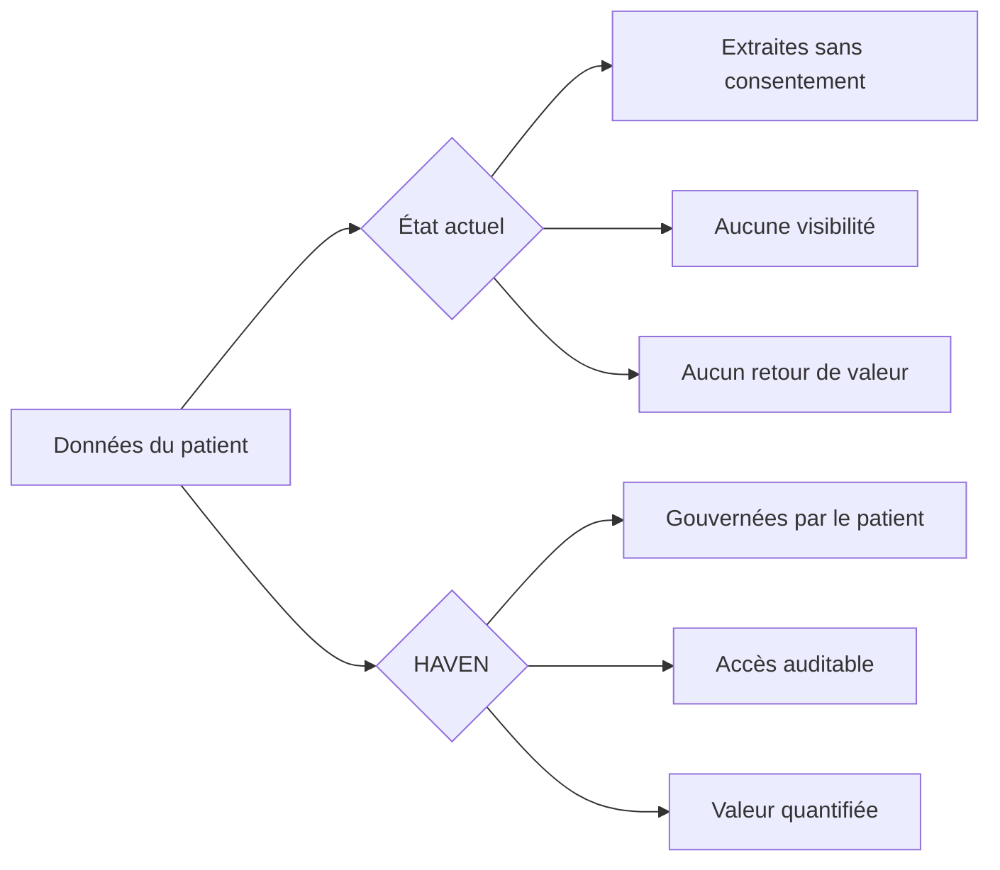
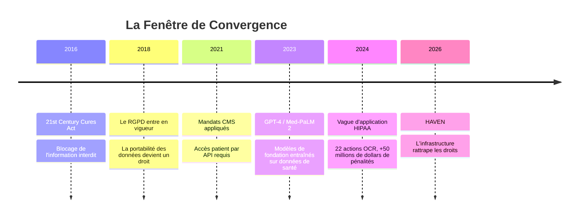
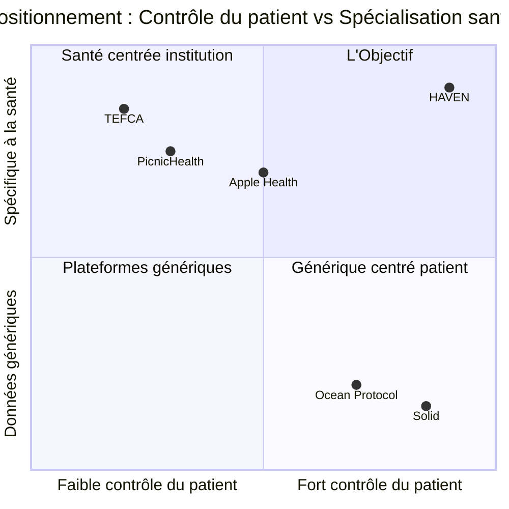
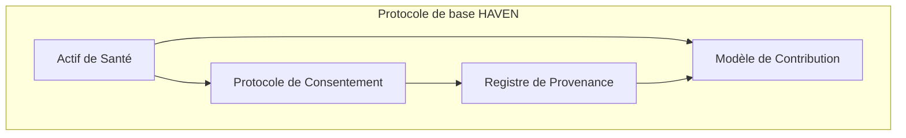
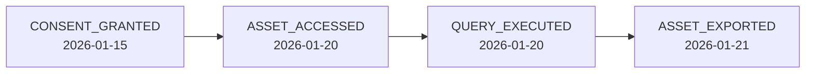
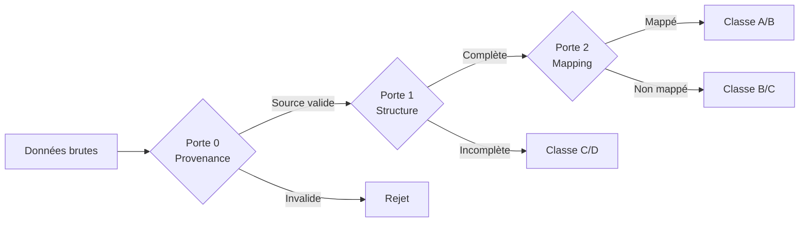
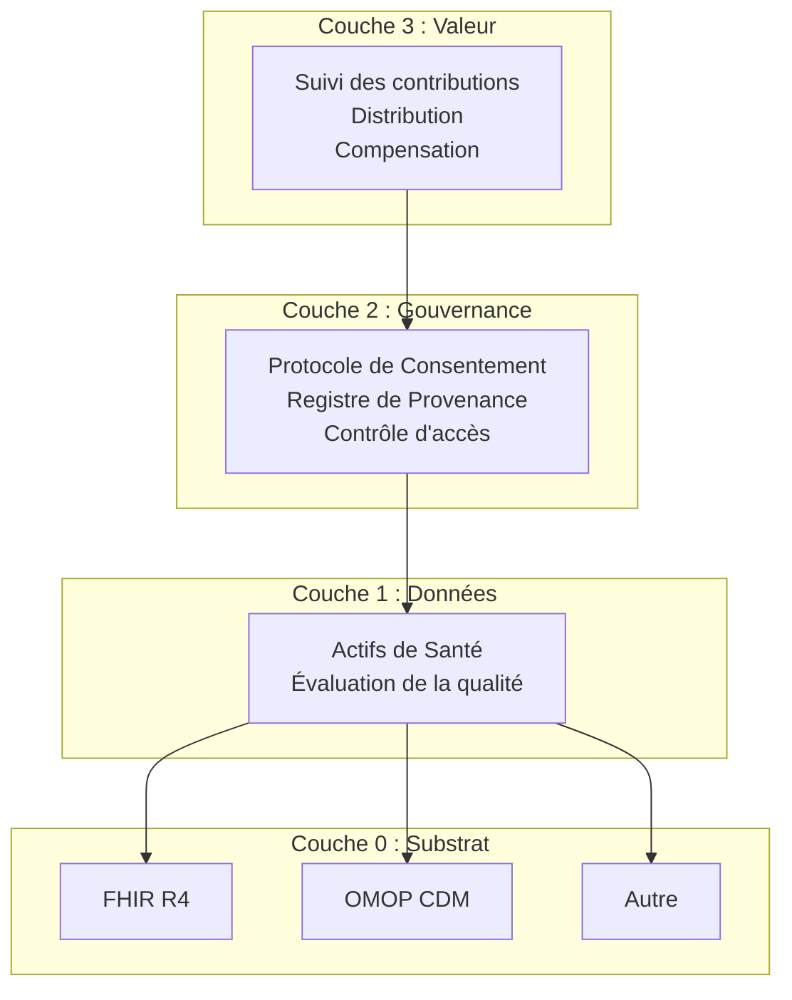
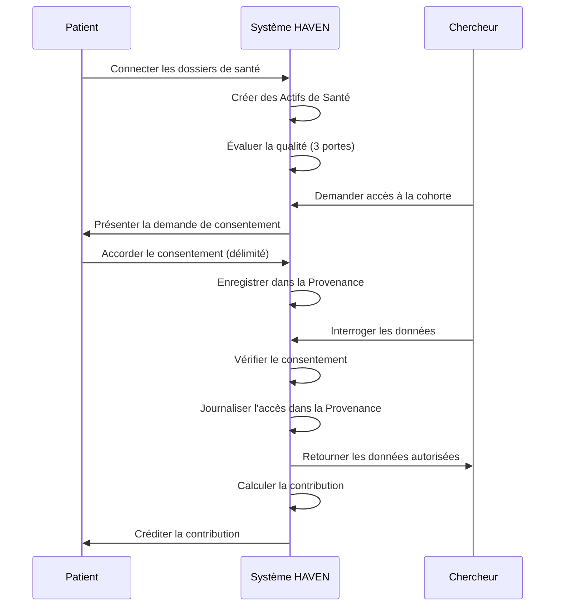

# HAVEN : Un Protocole d'Échange de Valeur pour les Données de Santé des Patients

**Version 2.0 | Février 2026**

---

## Résumé

HAVEN est un protocole pour les données de santé contrôlées par les patients. Il définit comment les données sont référencées, soumises au consentement, auditées et évaluées. Il ne dit rien sur la façon dont vous stockez les données, exécutez des calculs ou gérez les paiements.

Le protocole comprend quatre parties :
- **Actifs de Santé** : Des pointeurs intelligents vers des données cliniques avec une gouvernance intégrée
- **Protocole de Consentement** : Une autorisation exécutable par machine que les patients contrôlent vraiment
- **Registre de Provenance** : Une piste d'audit que personne ne peut falsifier
- **Modèle de Contribution** : Un moyen de mesurer la valeur des données des patients

Nous nous appuyons sur FHIR et OMOP parce qu'ils fonctionnent déjà. Nous laissons le stockage, le calcul et l'économie aux implémenteurs parce qu'une solution universelle ne convient pas à tous.

Ce document explique ce que HAVEN spécifie — et ce qu'il laisse délibérément ouvert.

---

## Table des matières

1. [Introduction](#1-introduction)
2. [Pourquoi maintenant](#2-pourquoi-maintenant)
3. [Travaux connexes](#3-travaux-connexes)
4. [Énoncé du problème](#4-énoncé-du-problème)
5. [Principes de conception](#5-principes-de-conception)
6. [Protocole de base HAVEN](#6-protocole-de-base-haven)
7. [Architecture de référence](#7-architecture-de-référence)
8. [Fondements](#8-fondements)
9. [Périmètre d'implémentation](#9-périmètre-dimplémentation)
10. [Conclusion](#10-conclusion)

---

## 1. Introduction

Chaque prise de sang, chaque imagerie, chaque note clinique que vous générez devient des données d'entraînement pour des systèmes d'IA que vous ne verrez jamais. Des modèles de fondation apprennent la médecine à partir de dossiers patients — dépassant souvent les spécialistes humains dans des tâches précises — tandis que les personnes dont les corps ont produit ces données n'ont leur mot à dire ni sur leur usage ni sur leur destination.

Voilà ce que ça donne en pratique : **vous ne pouvez pas voir qui a consulté vos dossiers, vous ne pouvez pas contrôler ce qu'on en fait, et vous ne touchez certainement pas votre part des milliards de dollars que vos données contribuent à générer.**

Shoshana Zuboff appelle ça le « capitalisme de surveillance » — l'expérience humaine extraite comme matière première gratuite [18]. Jaron Lanier est encore plus direct : les patients effectuent un travail de valeur chaque fois qu'ils consultent, mais la richesse va ailleurs [19].

Il y a trois siècles, John Locke soutenait que les gens possèdent les fruits de leur travail [20]. Si vous générez des données de santé à travers le travail de vivre — gérer une maladie chronique, vous présenter aux rendez-vous, supporter les aléas des soins médicaux — ne devriez-vous pas avoir votre mot à dire sur ce qu'il en advient ?

HAVEN part d'une prémisse simple : **la souveraineté des patients n'est pas une fonctionnalité à ajouter plus tard. C'est le fondement.**



Vous ne téléchargerez pas HAVEN depuis une boutique d'applications. C'est un protocole — des spécifications qui permettent à différents systèmes de fonctionner ensemble tout en maintenant les patients aux commandes.

---

## 2. Pourquoi maintenant

La souveraineté des données des patients a été techniquement impossible pendant la majeure partie de l'histoire moderne de la santé. Ça a changé.



### 2.1 L'infrastructure existe enfin

Il y a dix ans, construire ceci aurait nécessité de convaincre chaque hôpital d'adopter de nouveaux standards. Aujourd'hui :

| Composant | Statut | Importance |
|-----------|--------|------------|
| FHIR R4 | Largement adopté | API standard pour l'échange de données de santé |
| SMART on FHIR | Largement adopté [1] | Accès OAuth 2.0 autorisé par le patient |
| OMOP CDM | 974 millions de dossiers patients [2] | Modèle de données commun prêt pour la recherche |
| Mandats CMS | Appliqués depuis 2021 | Droit légal aux données de santé électroniques |

Les tentatives précédentes ont échoué parce que l'infrastructure n'existait pas :
- **Microsoft HealthVault (2007-2019)** : Arrêté en raison d'une faible adoption [3]
- **Google Health 1.0 (2008-2012)** : Abandonné, pour cause de manque d'utilisation généralisée [4]

La différence aujourd'hui : **les standards sont imposés, pas facultatifs**.

### 2.2 L'IA n'attend pas

Pendant que nous débattons des droits des patients, les modèles de fondation s'entraînent déjà sur des données de santé :

- **GPT-4** entraîné sur des corpus médicaux non divulgués sans mécanisme de consentement patient [5]
- **Med-PaLM 2** a atteint 86,5 % sur MedQA, entraîné sur des jeux de données cliniques [6]
- **PubMed** contient plus de 36 millions d'articles, de plus en plus utilisés pour l'entraînement d'IA médicale [7]

Pendant ce temps, les essais cliniques — une industrie de 84 milliards de dollars qui se dirige vers 158 milliards d'ici 2033 [8] — se noient dans leur propre inefficacité :

| Problème | Données |
|----------|---------|
| Échec du recrutement aux essais | 80 % des essais ne respectent pas les délais d'inscription [9] |
| Coût par patient | 6 533 dollars de coût de recrutement moyen par patient [10] |
| Délai d'acquisition des données | 6 à 18 mois pour un accès rétrospectif aux données [11] |
| Taux d'échec de sélection | 25 à 50 % des patients sélectionnés ne satisfont pas aux critères d'éligibilité [12] |

**La fenêtre se referme.** Une fois que les modèles sont entraînés sur des données non gouvernées, la provenance est définitivement perdue.

### 2.3 Les régulateurs en ont assez d'attendre

| Réglementation | Année | Impact |
|----------------|-------|--------|
| 21st Century Cures Act | 2016 | Blocage de l'information interdit ; pénalités de plus d'un million de dollars |
| Règles d'interopérabilité CMS | 2021 | Accès des patients aux données de remboursement rendu obligatoire |
| RGPD Article 20 [17] | 2018 | Portabilité des données comme droit fondamental |
| Droit d'accès HIPAA [16] | 2019 | Délai de réponse de 30 jours ; application par l'OCR |

Application en 2024 : **l'OCR du HHS a émis 22 actions d'application HIPAA**, avec plus de 50 pénalités pour violation du droit d'accès depuis 2019 [13].

Le cadre juridique pour le contrôle des patients arrive plus vite que l'infrastructure technique pour le soutenir. HAVEN comble ce fossé.

---

## 3. Travaux connexes

D'autres ont essayé de résoudre ce problème. Voilà pourquoi nous pensons qu'ils n'y sont pas parvenus — et ce que HAVEN fait différemment.

| Approche | Focalisation | Différenciation de HAVEN |
|----------|-------------|--------------------------|
| **Apple Health Records** | Agrégation grand public via SMART on FHIR | Agrégation uniquement ; pas de protocole de consentement, pas de marché de recherche, pas de suivi des contributions |
| **PicnicHealth** | Collecte de dossiers médicaux pour la recherche | Plateforme centralisée ; les patients ne contrôlent pas la gouvernance, le consentement est binaire |
| **Ocean Protocol** | Marché de données décentralisé | Focalisé sur les données génériques ; pas de standards spécifiques à la santé (FHIR/OMOP), pas de sémantique de consentement clinique |
| **Solid (Tim Berners-Lee)** | Pods de données personnelles | Usage général ; pas de modèle de données de santé, pas d'évaluation de qualité, pas de flux de travail de recherche |
| **CommonHealth (Android)** | Standard d'API de données de santé | API au niveau du périphérique ; pas de protocole de consentement, pas de provenance, pas de modèle de valeur |
| **TEFCA/Carequality** | Échange réseau à réseau | Centré sur l'institution ; le patient n'est pas le contrôleur des données |

#### Comparaison des capacités

|  | Contrôle du patient | Granularité du consentement | Piste d'audit | Suivi de valeur | Standards de santé | Prêt pour la recherche |
|--|:--:|:--:|:--:|:--:|:--:|:--:|
| **HAVEN** | ●●●● | ●●●● | ●●●● | ●●●● | ●●●● | ●●●● |
| Apple Health | ●●○○ | ●○○○ | ●○○○ | ○○○○ | ●●●○ | ○○○○ |
| PicnicHealth | ●○○○ | ●○○○ | ●●○○ | ●○○○ | ●●●○ | ●●●○ |
| Ocean Protocol | ●●●○ | ●●○○ | ●●●○ | ●●●○ | ○○○○ | ●○○○ |
| Solid | ●●●● | ●●○○ | ●●○○ | ○○○○ | ○○○○ | ○○○○ |
| TEFCA | ●○○○ | ●○○○ | ●●○○ | ○○○○ | ●●●● | ●●○○ |



**La place de HAVEN** : Nous avons repris l'idée de Solid (les patients possèdent leurs données) et nous l'avons fait fonctionner pour la santé. Ça signifie parler FHIR et OMOP, gérer les exigences particulières de consentement propres aux données de santé, et suivre la qualité d'une façon qui intéresse vraiment les chercheurs.

Ce n'est pas une application que vous téléchargez. C'est la plomberie qui permet à différentes applications de fonctionner ensemble sans que personne ne perde le contrôle de ses données.

---

## 4. Énoncé du problème

L'informatique de santé moderne a résolu l'interopérabilité. Elle a oublié le patient. Quatre défaillances persistent :

| Problème | Description | Réponse de HAVEN |
|----------|-------------|------------------|
| **Interopérabilité sans gouvernance** | Les données circulent entre les systèmes ; le consentement non | Les Actifs de Santé intègrent la gouvernance |
| **Consentement statique** | Binaire, grossier, permanent | Protocole de Consentement : dynamique, granulaire, révocable |
| **Aucune piste d'audit** | Utilisation invisible pour les patients | Registre de Provenance : journal en ajout seul |
| **Extraction de valeur** | Patients exclus de la valeur | Modèle de Contribution : quantifié, transparent |

---

## 5. Principes de conception

Nous avons fait des choix. Voici ce en quoi nous croyons :

**Le contrôle du patient passe en premier.** Pas comme une fonctionnalité qu'on ajoutera plus tard, mais comme le fondement architectural. Tout le reste en découle.

**Le consentement doit être du code, pas de la paperasse.** Un formulaire signé qui dort dans un classeur n'aide personne. Le consentement doit être lisible par machine, exécutable par machine, et révocable en temps réel.

**Chaque accès laisse une trace.** Pas de lectures silencieuses. Pas de requêtes invisibles. Si quelqu'un touche les données, ce fait est enregistré.

**La valeur du patient doit être mesurable.** Si les données ont de la valeur, nous devons pouvoir quantifier qui a contribué quoi.

**Travailler avec les régulateurs, pas autour d'eux.** HAVEN vous aide à respecter HIPAA et le RGPD. Il ne remplace pas les exigences légales — il les rend plus faciles à satisfaire.

**Aucun verrouillage technologique.** Utilisez la base de données que vous voulez. Déployez où vous voulez. Le protocole s'en fiche.

Ces idées ne sont pas nouvelles. Beauchamp et Childress ont posé le cadre éthique en 1979 : **autonomie**, **bienfaisance**, **non-malfaisance**, **justice** [21]. HAVEN se contente de prendre ces principes et d'en faire des exigences techniques :

| Principe HAVEN | Fondement éthique |
|----------------|-------------------|
| Souveraineté nativement patient | **Autonomie** : respect de l'autodétermination du patient |
| Auditable par défaut | **Non-malfaisance** : prévenir les préjudices cachés par la transparence |
| Quantification de la contribution | **Justice** : distribution équitable des bénéfices et des charges |
| Compatibilité réglementaire | **Bienfaisance** : permettre de bons résultats dans les cadres légaux |

Lawrence Lessig l'a dit simplement : « le code, c'est la loi » [22]. Les choix techniques que nous faisons encodent des valeurs, que nous l'admettions ou non. HAVEN choisit explicitement la souveraineté des patients. Ce n'est pas une contrainte que l'on contourne — c'est le but.

---

## 6. Protocole de base HAVEN

HAVEN est délibérément minimal. Quatre primitives, spécifiées de façon serrée. Tout le reste — comment vous stockez les données, exécutez des calculs, gérez les paiements — c'est votre affaire.



**Comment elles s'articulent :**
- Chaque **Actif de Santé** requiert une référence de **Consentement** (pas de données « nues »)
- Chaque opération de **Consentement** crée une entrée de **Provenance** (piste d'audit)
- La **Contribution** calcule la valeur à partir des **Actifs** en utilisant la **Provenance** pour l'attribution

### 6.1 Actif de Santé

Pensez à un Actif de Santé comme à un « pointeur intelligent » vers des données cliniques. Ce n'est pas la donnée elle-même — c'est une référence qui porte ses propres règles de gouvernance. Vous ne pouvez pas toucher les données sous-jacentes sans passer par la machinerie de consentement et d'audit attachée à l'actif.

#### Spécification

```
HealthAsset := {
    asset_id        : ContentHash      // Dérivé du contenu
    data_ref        : SecureReference  // Pointeur vers les données cliniques
    substrate       : Identifier       // Format de données (FHIR, OMOP, etc.)
    consent_ref     : ConsentID        // Politique de consentement active
    quality_class   : {A, B, C, D}     // Note de qualité des données
    provenance_ref  : ProvenanceID     // Référence à la chaîne d'audit
    patient_ref     : PatientID        // Propriétaire de ces données
    created_at      : Timestamp
}
```

#### Ce qui le fait fonctionner

Vous ne pouvez pas créer un Actif de Santé sans référence de consentement. Le protocole le rejette. Ce n'est pas un choix de politique — c'est appliqué au niveau de la structure de données.

Le `asset_id` provient du hachage du contenu (SHA-256), donc si quelqu'un falsifie les données, l'identifiant ne correspondra plus. Même astuce que Git. L'actif peut exister en FHIR, OMOP ou dans le format dont votre système a besoin — des mappings sémantiques gèrent la traduction. Et chaque actif reçoit une note de qualité (A à D) selon la façon dont il passe les portes de validation.

#### Exemple

```json
{
  "asset_id": "sha256:a1b2c3...",
  "data_ref": "omop://person/12345/measurement/67890",
  "substrate": "OMOP-CDM-6.0",
  "consent_ref": "consent:98765",
  "quality_class": "A",
  "provenance_ref": "prov:chain:11111",
  "patient_ref": "patient:alice-12345",
  "created_at": "2026-01-15T10:30:00Z"
}
```

---

### 6.2 Protocole de Consentement

Le consentement actuel est une fiction : vous signez un formulaire de 40 pages que vous n'avez pas lu, accordant des droits permanents que vous ne pouvez pas révoquer, pour des usages de vos données dont vous n'entendrez jamais parler. Le Protocole de Consentement de HAVEN transforme le consentement en quelque chose qui fonctionne vraiment.

#### Spécification

```
ConsentAttestation := {
    consent_id      : UUID
    grantor         : PatientIdentity   // Qui accorde
    grantee         : AccessorIdentity  // Qui reçoit
    scope           : DataScope         // Quelles données
    purpose         : PurposeType       // Pourquoi
    conditions      : Conditions[]      // Sous quelles règles
    granted_at      : Timestamp
    expires_at      : Timestamp | null
    status          : {active, revoked, expired}
    signature       : CryptoSignature
}

DataScope := {
    resource_types  : ResourceType[]    // Pathologies, Labos, Médicaments, etc.
    time_range      : TimeRange | null  // Bornes historiques
    exclusions      : ResourceType[]    // Explicitement exclus
}
```

#### Opérations

| Opération | Description |
|-----------|-------------|
| `grant()` | Créer une nouvelle attestation de consentement |
| `verify()` | Vérifier si l'accès est autorisé |
| `revoke()` | Retirer le consentement (immédiatement) |
| `list()` | Voir tous les consentements (pour la transparence du patient) |

#### Exemple : Consentement à la recherche

```yaml
consent:
  grantor: "patient:alice"
  grantee: "study:diabetes-cgm-2026"
  scope:
    resource_types: [Measurement, Condition, DrugExposure]
    time_range: {start: "2020-01-01", end: null}
    exclusions: [Note, Observation.mental_health]
  purpose: "RESEARCH"
  conditions:
    - type: "AGGREGATION_ONLY"
      min_cohort_size: 50
    - type: "NO_REIDENTIFICATION"
  expires_at: "2027-01-15"
```

**Ce que le patient voit** : « Je partage mes analyses, mes pathologies et mes médicaments (mais pas mes notes de santé mentale) avec l'étude CGM sur le diabète. Ils ne peuvent les utiliser qu'en agrégat avec 50 autres patients minimum. Ça expire dans un an. Je peux révoquer à tout moment. »

#### Ce que le protocole garantit

Exécutez le même contrôle de consentement deux fois avec les mêmes entrées — vous obtenez la même réponse. Pas de hasard, pas de « ça dépend ». C'est important pour l'audit.

Quand un patient révoque son consentement, c'est immédiat. Pas « sous 24 heures » ou « après la prochaine synchronisation ». Le prochain appel `verify()` retourne refusé. Point.

Et nous utilisons la sémantique du monde fermé : si vous n'avez pas explicitement accordé l'accès à un type de ressource, la réponse est non. Le silence signifie le refus, pas la permission.

#### Pourquoi ça compte

Nous n'avons pas inventé ces idées. Après les expériences médicales nazies, le Code de Nuremberg (1947) a établi que le consentement volontaire n'est pas facultatif — c'est le fondement éthique [23]. Le Rapport Belmont (1979) l'a codifié pour la recherche moderne [24]. Nous ne faisons que rendre ces principes exécutables.

Le cadre d'« intégrité contextuelle » d'Helen Nissenbaum explique pourquoi le consentement actuel échoue [25] : une information appropriée dans un contexte (partager ses symptômes avec son médecin) devient une violation quand elle circule vers un autre (cette donnée entraîne un modèle publicitaire). HAVEN applique le contexte. Les données partagées pour la recherche restent dans la recherche. Un point c'est tout.

#### PSDL : Un langage de politique déclaratif (optionnel)

HAVEN recommande **[PSDL](https://github.com/Chesterguan/PSDL)** (Patient Scenario Definition Language — Langage de Définition de Scénarios Patients) pour les politiques de consentement et les scénarios cliniques. PSDL est **optionnel mais recommandé** pour les implémentations qui souhaitent une logique d'autorisation lisible par l'humain et exécutable par la machine.

**Pourquoi PSDL ?** Au lieu d'algorithmes opaques, les patients peuvent comprendre leur consentement :
- *« Ceci partage mes données de laboratoire avec l'Étude Diabète »*
- *« Ils ne peuvent les utiliser qu'en agrégat avec 50 autres patients minimum »*
- *« C'est basé sur les recommandations cliniques de l'ADA »*

Mêmes entrées, mêmes sorties, à chaque fois — et vous pouvez retracer exactement pourquoi une décision a été prise. Voir [Annexe C : Référence PSDL](#annexe-c-référence-psdl) pour son fonctionnement.

---

### 6.3 Registre de Provenance

En ce moment, vous n'avez aucune idée de qui a consulté vos dossiers médicaux mardi dernier. Le Registre de Provenance règle ça — un journal en ajout seul de chaque accès, chaque requête, chaque export. Personne ne peut effacer ses traces.

#### Spécification

```
ProvenanceEntry := {
    entry_id        : UUID
    timestamp       : Timestamp
    event_type      : EventType
    actor           : Identity
    subject         : AssetRef | ConsentRef
    details         : EventData
    previous_hash   : Hash          // Lien de chaîne
    signature       : CryptoSignature
}

EventType := {
    ASSET_CREATED, ASSET_ACCESSED, ASSET_EXPORTED,
    CONSENT_GRANTED, CONSENT_VERIFIED, CONSENT_REVOKED,
    QUERY_EXECUTED, COMPUTATION_RUN
}
```

#### Comment ça reste honnête

Une fois qu'une entrée est ajoutée, elle reste. Pas de modifications, pas de suppressions. Chaque entrée inclut le hachage de la précédente, donc toute falsification de l'historique brise la chaîne — il faudrait réécrire tout ce qui vient après. (Oui, comme une blockchain, mais sans la mise en scène du consensus.)

Chaque entrée est signée. Ed25519 ou ECDSA, au choix. La signature lie chaque action à un acteur spécifique, et les patients peuvent consulter leur historique complet via une API authentifiée. La vérification est en O(log n) — pas besoin de rejouer toute la chaîne pour vérifier une seule entrée.

#### Exemple : Journal d'accès



```json
{
  "entry_id": "prov:entry:555",
  "timestamp": "2026-01-20T14:30:00Z",
  "event_type": "ASSET_ACCESSED",
  "actor": "researcher:bob@stanford.edu",
  "subject": "asset:a1b2c3",
  "details": {
    "consent_ref": "consent:98765",
    "purpose": "diabetes-cgm-study",
    "access_type": "READ"
  },
  "previous_hash": "sha256:prev...",
  "signature": "sig:..."
}
```

---

### 6.4 Modèle de Contribution

Si les données des patients ont de la valeur — et elles en ont clairement, au vu des milliards qui circulent dans l'économie des données de santé — alors les patients devraient en voir une partie. Le Modèle de Contribution crée le système comptable pour rendre ça possible.

#### Spécification

```
Contribution := {
    patient_id      : PatientIdentity
    asset_refs      : AssetRef[]
    quality_score   : Float[0, 1]
    tier            : ContributionTier
    context         : UsageContext      // Étude, requête, etc.
    timestamp       : Timestamp
}

ContributionTier := {
    PROFILE,        // Données démographiques, infos de base
    STRUCTURED,     // Labos, médicaments, pathologies
    LONGITUDINAL,   // Dossiers sur plusieurs années
    COMPLEX         // Notes, imagerie, génomique
}
```

#### Évaluation de la qualité

HAVEN définit un protocole de qualité à trois portes :



| Porte | Vérifications | Résultat en cas d'échec |
|-------|---------------|-------------------------|
| Porte 0 : Provenance | Source valide, intégrité du hachage | Rejeté |
| Porte 1 : Structure | Champs requis, codes valides | Classe C/D |
| Porte 2 : Mapping | Concepts standards, prêt pour la recherche | Classe B/C |

#### Calcul du score de qualité

Chaque porte contribue à un score de qualité composite :

```
ScoreQualité = G₀ × (w₁·G₁ + w₂·G₂)

Où :
  G₀ = Porte de provenance (binaire : 0 ou 1)
  G₁ = Complétude structurelle (0,0 à 1,0)
  G₂ = Couverture du mapping de concepts (0,0 à 1,0)
  w₁ = 0,4 (pondération structure)
  w₂ = 0,6 (pondération mapping)
```

La classe de qualité découle du score :

| Score de qualité | Classe | Signification |
|------------------|--------|---------------|
| ≥ 0,90 | A | Qualité recherche, entièrement mappé |
| 0,75 – 0,89 | B | Bonne qualité, lacunes mineures |
| 0,50 – 0,74 | C | Utilisable avec réserves |
| < 0,50 | D | Utilité limitée |

Si G₀ = 0 (la provenance échoue), l'actif est entièrement rejeté — aucun score n'est attribué.

#### Exemple : Calcul de contribution

```
La patiente Alice contribue à l'Étude X :
  - 3 ans de données de laboratoire (niveau LONGITUDINAL)
  - Classe de qualité A (toutes les portes franchies)
  - 847 mesures, 23 pathologies

Score de contribution = PoidsNiveau × ScoreQualité × NormVolume
                      = 1,0 × 0,95 × 0,87
                      = 0,83
```

Le score (0,0 à 1,0) est un poids relatif, pas un montant en euros. Si Alice obtient 0,83 et Bob 0,41, Alice a contribué environ deux fois plus à cette étude. Ce que ça représente en argent réel ? C'est votre affaire, à vous, à vos utilisateurs et à votre modèle économique.

Les pondérations que nous fournissons sont des points de départ. Une étude de génomique pourrait valoriser différemment les données de niveau COMPLEX par rapport à une enquête de santé populationnelle. Adaptez en conséquence.

#### La question plus difficile : qu'est-ce qui est juste ?

Répartir la valeur équitablement quand de nombreuses personnes contribuent est vraiment difficile. Rawls a soutenu que les inégalités n'ont de sens que si elles aident les plus défavorisés [26]. En termes de données de santé : les patients supportent les vrais risques (vie privée, discrimination, conséquences sur l'assurance). Ils devraient partager les vrais bénéfices.

Elinor Ostrom a remporté un Prix Nobel en démontrant que les communautés peuvent gouverner des ressources communes sans les privatiser ni les confier à l'État [27]. Les données patients s'inscrivent dans ce modèle : un **commun gouverné**. Pas mis sous clé (ça n'aide personne). Pas extrait librement (ça aide tout le monde sauf les patients). Géré collectivement, par le consentement et une comptabilité transparente.

---

## 7. Architecture de référence

Vous pouvez construire des systèmes conformes à HAVEN de nombreuses façons : lacs de données centralisés, réseaux fédérés, architectures de calcul vers les données où ce sont les requêtes qui se déplacent plutôt que les données. Peu importe. Le protocole spécifie les structures de données et les sémantiques — la façon dont vous les déployez, c'est votre affaire.

Voici une façon de penser aux couches (mais ne traitez pas ça comme parole d'évangile) :



### Exemple de flux de données

Une façon dont ça pourrait fonctionner (la vôtre pourrait être différente — peut-être que les données restent chiffrées et seul le patient peut les déverrouiller, ou les requêtes se déplacent vers les données plutôt que l'inverse) :



---

## 8. Fondements

Nous n'inventons pas de nouveaux standards. La santé en a déjà trop. HAVEN s'appuie sur ce qui fonctionne déjà :

| Fondement | Rôle dans HAVEN | Échelle d'adoption |
|-----------|-----------------|--------------------|
| **FHIR R4** | Format d'échange de données | Imposé par CMS ; supporté par Epic, Cerner, tous les principaux DPI [14] |
| **OMOP CDM** | Modèle de données de recherche | 974 millions de dossiers patients dans 544 bases dans 54 pays [2][15] |
| **SMART on FHIR** | Cadre d'autorisation | Principaux DPI (Epic, Cerner, Allscripts) ; intégration Apple Health Records [1] |
| **OAuth 2.0 / OIDC** | Authentification | Standard industriel ; plus d'un milliard d'authentifications quotidiennes dans le monde |
| **Stockage adressable par contenu** | Intégrité des actifs | Éprouvé dans Git (100M+ dépôts), IPFS, systèmes blockchain |

### Détails des fondements techniques

**Couverture du vocabulaire OMOP :**
- Plus de 270 000 concepts standards dans plus de 100 vocabulaires
- Mappings ICD-10 → SNOMED-CT pour plus de 95 % des codes de diagnostic
- Couverture RxNorm pour plus de 99 % des médicaments prescrits aux États-Unis
- Mappings LOINC pour les observations de laboratoire

**Types de ressources FHIR R4 :**
Les Actifs de Santé HAVEN se mappent sur les ressources FHIR suivantes : `Patient`, `Condition`, `Observation`, `MedicationRequest`, `Procedure`, `DiagnosticReport`, `DocumentReference`.

### Pourquoi ça compte

La santé n'a pas besoin d'un autre format propriétaire qui oblige tout le monde à arracher ses systèmes existants. HAVEN se branche sur ce qui est déjà là — votre instance Epic, votre entrepôt OMOP, votre authentification existante. Les standards ont l'adhésion institutionnelle et le soutien réglementaire. Vous n'attendez pas des percées en recherche ; c'est de l'ingénierie d'intégration. Et avec 330+ bases de données parlant déjà OMOP, vous ne partez pas de zéro.

---

## 9. Périmètre d'implémentation

Nous sommes tranchés sur certaines choses et délibérément silencieux sur d'autres. Voilà où se trouve la limite.

### HAVEN spécifie

| Composant | Spécification |
|-----------|---------------|
| Structure des Actifs de Santé | Champs requis, adressage par contenu, notes de qualité |
| Protocole de Consentement | Opérations, format d'attestation, algorithme de vérification |
| Registre de Provenance | Types d'événements, chaînage de hachage, preuves Merkle |
| Modèle de Contribution | Niveaux, portes de qualité, formule de calcul de valeur |
| Paquet d'échange | Format d'interopérabilité pour le transfert de données |

**Note** : Les quatre primitives (Actif de Santé, Consentement, Provenance, Contribution) forment le protocole de base. Le Paquet d'échange est une infrastructure de soutien pour transférer des données entre systèmes conformes à HAVEN.

### Les implémentations décident

| Choix | Options | Position de HAVEN |
|-------|---------|-------------------|
| **Substrat de données** | FHIR, OMOP, MEDS, personnalisé | Tout format conforme aux standards |
| **Stockage** | PostgreSQL, MongoDB, blockchain | Agnostique au protocole |
| **Modèle de calcul** | Centralisé, fédéré, enclave | Tous valides si le consentement est appliqué |
| **Interface utilisateur** | Application mobile, web, API uniquement | Non spécifié |
| **Rails de paiement** | Fiat, crypto, points | Choix d'implémentation |
| **Ingestion de données** | Fasten, 1upHealth, DPI direct | Toute source conforme |
| **Chiffrement** | AES, ChaCha20, etc. | Choix d'implémentation |
| **Gestion des clés** | Dépositaire, auto-souverain, récupération sociale | Choix d'implémentation |
| **Vérification d'identité** | KYC, DID, OAuth, etc. | Choix d'implémentation |

### Économie : délibérément ouvert

Nous savons mesurer la contribution. Nous n'allons pas vous dire comment la payer.

HAVEN fournit la comptabilité : `Valeur = PoidsNiveau × ScoreQualité × NormVolume`. Les pondérations de référence et les seuils de qualité sont dans la spécification. Mais les rails de paiement ? La conception du marché ? L'économie des tokens ? C'est à vous de le résoudre.

Ce n'est pas une dérobade. C'est la reconnaissance que le bon modèle économique dépend du contexte — la recherche académique, les essais commerciaux et les groupes de défense des patients auront besoin d'approches différentes. HAVEN leur donne un langage commun pour la valeur ; ils décident de ce qu'ils en font.

### Ce que ça signifie

Un système conforme à HAVEN :

- ✅ DOIT implémenter les primitives Actif de Santé, Consentement, Provenance, Contribution
- ✅ DOIT appliquer la vérification du consentement avant l'accès aux données
- ✅ DOIT maintenir des registres de provenance en ajout seul
- ✅ DOIT supporter le format Paquet d'échange pour l'interopérabilité
- ⚪ PEUT utiliser toute approche de stockage, de calcul ou d'interface
- ⚪ PEUT implémenter tout modèle de distribution économique
- ⚪ PEUT étendre le protocole avec des fonctionnalités supplémentaires

### Extensions optionnelles

- **PSDL** (Patient Scenario Definition Language) : Langage de politique déclaratif pour le consentement et les scénarios cliniques. Recommandé mais non requis. Voir [github.com/Chesterguan/PSDL](https://github.com/Chesterguan/PSDL).

### Ce que nous n'essayons pas de faire

La prolifération du périmètre tue les protocoles. Voilà ce que HAVEN ignore délibérément :

- **Conformité** : HAVEN vous aide à respecter HIPAA/RGPD. Il ne remplace pas vos avocats.
- **Marchés** : Nous mesurons la valeur. Nous ne construisons pas de systèmes de paiement.
- **Interfaces utilisateurs** : Comment les patients et les chercheurs interagissent ? C'est votre affaire.
- **Nouveaux formats de données** : Nous utilisons FHIR et OMOP. Nous n'inventons pas un autre standard.
- **Choix technologiques** : Pas de blockchain obligatoire. Pas de dépendance à un fournisseur cloud. Pas d'opinion sur votre base de données.
- **Identité** : Comment vous vérifiez que les patients sont qui ils prétendent être, c'est à vous.

---

## 10. Conclusion

Le marché que les patients obtiennent aujourd'hui est mauvais : générer les données, supporter les risques, ne voir aucune valeur. HAVEN ne règle pas ça par de meilleures intentions ou une réglementation plus stricte. Il le règle par l'infrastructure.

Quatre primitives. C'est l'intégralité du protocole : Actif de Santé, Protocole de Consentement, Registre de Provenance, Modèle de Contribution. Assez pour rendre la souveraineté des patients techniquement exécutoire. Pas assez pour enfermer qui que ce soit dans une implémentation particulière.

Le moment compte. FHIR et OMOP sont imposés ou largement adoptés. Des modèles de fondation sont entraînés sur des données de santé en ce moment même. Les régulateurs appliquent les droits d'accès des patients avec de vraies pénalités. La fenêtre pour construire cette infrastructure est ouverte — mais elle ne restera pas ouverte éternellement.

---

Nous construisons une implémentation de référence pour prouver que ça fonctionne. Si les données de santé souveraines par les patients vous intéressent, contactez-nous.

**Contact** : chesterfield199512@gmail.com

---

## Références

[1] Mandel, J.C., et al. « SMART on FHIR: A standards-based, interoperable apps platform for electronic health records. » *Journal of the American Medical Informatics Association* 23.5 (2016) : 899-908.

[2] OHDSI. « OHDSI Network Statistics. » Observational Health Data Sciences and Informatics, 2024. https://ohdsi.org/

[3] Microsoft. « HealthVault Service Discontinuation. » Microsoft Health Blog, 2019.

[4] Google. « An update on Google Health and Google PowerMeter. » Official Google Blog, 2011.

[5] OpenAI. « GPT-4 Technical Report. » arXiv:2303.08774, 2023.

[6] Singhal, K., et al. « Towards Expert-Level Medical Question Answering with Large Language Models. » arXiv:2305.09617, 2023.

[7] National Library of Medicine. « PubMed Overview. » NIH, 2024. https://pubmed.ncbi.nlm.nih.gov/

[8] Grand View Research. « Clinical Trials Market Size Report, 2024-2032. » 2024.

[9] Fogel, D.B. « Factors associated with clinical trials that fail and opportunities for improving the likelihood of success. » *Contemporary Clinical Trials Communications* 11 (2018) : 156-164.

[10] Sertkaya, A., et al. « Key cost drivers of pharmaceutical clinical trials in the United States. » *Clinical Trials* 13.2 (2016) : 117-126.

[11] TriNetX. « Real-World Data Access Benchmarks. » 2023.

[12] Getz, K.A. « Examining and Enabling the Role of Health Care Providers as Patient Recruitment Partners. » *Clinical Therapeutics* 39.11 (2017) : 2244-2249.

[13] HHS Office for Civil Rights. « HIPAA Enforcement Highlights. » 2024. https://www.hhs.gov/hipaa/

[14] HL7 International. « FHIR R4 Specification. » https://hl7.org/fhir/R4/

[15] OHDSI. « OMOP Common Data Model v6.0. » https://ohdsi.github.io/CommonDataModel/

[16] HIPAA Privacy Rule. 45 CFR Part 160 and Part 164.

[17] RGPD. Règlement (UE) 2016/679 du Parlement européen.

[18] Zuboff, S. *L'Âge du capitalisme de surveillance : Le combat pour un avenir humain face aux nouvelles frontières du pouvoir.* PublicAffairs, 2019.

[19] Lanier, J. *Qui possède le futur ?* Simon & Schuster, 2013.

[20] Locke, J. *Deux traités du gouvernement civil.* 1689. (Chapitre V : « De la propriété »)

[21] Beauchamp, T.L., et Childress, J.F. *Principles of Biomedical Ethics.* 8e éd., Oxford University Press, 2019. (Publié initialement en 1979)

[22] Lessig, L. *Code : Version 2.0.* Basic Books, 2006.

[23] « Le Code de Nuremberg. » *Procès des criminels de guerre devant les tribunaux militaires de Nuremberg.* U.S. Government Printing Office, 1949. (Initialement émis en 1947)

[24] Commission nationale pour la protection des sujets humains de la recherche biomédicale et comportementale. *Le Rapport Belmont : Principes éthiques et lignes directrices pour la protection des sujets humains de la recherche.* U.S. Department of Health, Education, and Welfare, 1979.

[25] Nissenbaum, H. « Privacy as Contextual Integrity. » *Washington Law Review* 79.1 (2004) : 119-158.

[26] Rawls, J. *Théorie de la justice.* Harvard University Press, 1971.

[27] Ostrom, E. *Gouverner les biens communs : L'évolution des institutions pour l'action collective.* Cambridge University Press, 1990.

---

## Annexe A : Glossaire

| Terme | Définition |
|-------|------------|
| Actif de Santé | Objet de données patient avec métadonnées de gouvernance |
| Attestation de Consentement | Enregistrement d'autorisation signé |
| Registre de Provenance | Piste d'audit en ajout seul |
| Contribution | Valeur quantifiée des données patient |
| Classe de Qualité | Note de qualité des données A/B/C/D |
| Substrat | Format de données sous-jacent (FHIR, OMOP, etc.) |

---

## Annexe B : Considérations de sécurité (non normative)

Les implémentations HAVEN doivent traiter les catégories de menaces suivantes :

| Menace | Description |
|--------|-------------|
| **Accès non autorisé** | Contournement du Protocole de Consentement pour accéder directement aux données |
| **Falsification de la provenance** | Modification ou suppression des entrées de la piste d'audit |
| **Manipulation des incitations** | Fabrication de scores de qualité ou de métriques de contribution |
| **Réidentification** | Inférence d'identité individuelle à partir de données agrégées |
| **Dérive du périmètre de consentement** | Exploitation de consentements accordés trop larges |

Les mécanismes d'atténuation spécifiques sont définis par l'implémentation. Les implémentations sont encouragées à :

- Utiliser des signatures cryptographiques pour toutes les attestations de consentement
- Implémenter des seuils d'agrégation minimaux pour les requêtes
- Employer le chaînage de hachage pour l'intégrité de la provenance
- Conduire des audits réguliers des schémas d'accès

Cette annexe est non normative. Les exigences de sécurité peuvent varier selon la juridiction et le cas d'usage.

---

## Annexe C : Référence PSDL

**Dépôt** : https://github.com/Chesterguan/PSDL

PSDL (Patient Scenario Definition Language — Langage de Définition de Scénarios Patients) est un langage déclaratif pour spécifier des scénarios cliniques, des politiques de consentement et des schémas d'accès aux données.

### Structure de base

```yaml
scenario: <nom_du_scenario>
version: "<semver>"

# Bloc d'audit - explique l'intention et les preuves
audit:
  intent: "Ce que ce scénario détecte"
  rationale: "Pourquoi cette détection est importante"
  provenance: "Recommandation clinique ou source de recherche"

# Signaux - lie les références de données cliniques
signals:
  <nom_du_signal>:
    ref: <concept_clinique>       # ex. créatinine, glucose, fréquence_cardiaque
    concept_id: <omop_id>         # Identifiant de concept standard OMOP
    unit: <unité_de_mesure>       # ex. mg/dL, mmol/L

# Tendances - calcule des caractéristiques temporelles
trends:
  <nom_de_tendance>:
    expr: <expression_temporelle>
    description: "Explication lisible par l'humain"

# Logique - définit les règles de détection
logic:
  <nom_de_regle>:
    when: <expression_booléenne>
    severity: low | medium | high
    description: "Ce que cette règle détecte"

# Population (optionnel) - critères d'inclusion des patients
population:
  age: "<condition>"              # ex. ">= 18"
  conditions: [<liste_conditions>]  # ex. [diabete, hypertension]
```

### Opérateurs temporels

| Opérateur | Syntaxe | Description |
|-----------|---------|-------------|
| `delta` | `delta(signal, fenetre)` | Variation sur la fenêtre temporelle |
| `slope` | `slope(signal, fenetre)` | Direction de la tendance linéaire |
| `ema` | `ema(signal, fenetre)` | Moyenne mobile exponentielle |
| `last` | `last(signal)` | Valeur la plus récente |
| `min` | `min(signal, fenetre)` | Minimum dans la fenêtre |
| `max` | `max(signal, fenetre)` | Maximum dans la fenêtre |
| `count` | `count(signal, fenetre)` | Nombre d'observations |

**Formats de fenêtre** : `30s`, `6h`, `24h`, `7d`, `30d`, `1y`

### Exemple : Cohorte de recherche sur le diabète

```yaml
scenario: T2DM_CGM_Cohort
version: "1.0.0"

audit:
  intent: "Identifier les patients diabétiques de type 2 adaptés à l'étude CGM"
  rationale: "Les études CGM requièrent un DT2 confirmé avec des données HbA1c récentes"
  provenance: "ADA Standards of Medical Care in Diabetes (2025)"

signals:
  HbA1c:
    ref: hemoglobin_a1c
    concept_id: 3004410
    unit: "%"

  glucose:
    ref: fasting_glucose
    concept_id: 3004501
    unit: mg/dL

population:
  age: ">= 30 AND <= 65"
  conditions: [type_2_diabetes]
  medications: [metformin]
  min_history: 365d

trends:
  hba1c_recent:
    expr: last(HbA1c)
    description: "HbA1c le plus récent"

  hba1c_trend:
    expr: slope(HbA1c, 180d)
    description: "Tendance HbA1c sur 6 mois"

logic:
  eligible:
    when: hba1c_recent >= 7.0 AND hba1c_recent <= 10.0
    description: "HbA1c dans la plage cible de l'étude"

  stable:
    when: abs(hba1c_trend) < 0.5
    description: "Contrôle glycémique relativement stable"

  cohort_match:
    when: eligible AND stable
    description: "Correspond aux critères de l'étude CGM"
```

### Exemple de politique de consentement

```yaml
scenario: Research_Consent_Policy
version: "1.0.0"

audit:
  intent: "Définir les permissions de partage de données pour la recherche sur le diabète"
  rationale: "Consentement granulaire contrôlé par le patient pour la participation à la recherche"

scope:
  grant:
    - Measurement.laboratory
    - Condition.endocrine
    - DrugExposure.antidiabetic
  deny:
    - Note.*
    - Observation.mental_health

  time_range:
    start: "2020-01-01"
    end: null  # en cours

conditions:
  - type: AGGREGATION_ONLY
    min_cohort_size: 50
  - type: NO_REIDENTIFICATION
  - type: PURPOSE_RESTRICTED
    allowed: [RESEARCH, PUBLIC_HEALTH]

expiration: "2027-01-15"
revocable: true
```

### Sémantique d'exécution

```
evaluate(scenario, patient_data) → {
    matched: boolean,
    triggered_rules: Rule[],
    confidence: float,
    audit_entry: ProvenanceEntry
}
```

**Sur quoi vous pouvez compter :** Exécutez le même scénario sur les mêmes données — vous obtiendrez le même résultat à chaque fois. Chaque évaluation laisse une trace dans le journal de provenance. Et les scénarios ne peuvent voir que ce qu'ils déclarent explicitement dans leur bloc de signaux ; ils ne peuvent pas fouiller d'autres données.

---

*Livre Blanc du Protocole HAVEN v2.0 | Février 2026*

*Ce document est publié sous licence Creative Commons Attribution 4.0 International (CC BY 4.0).*
