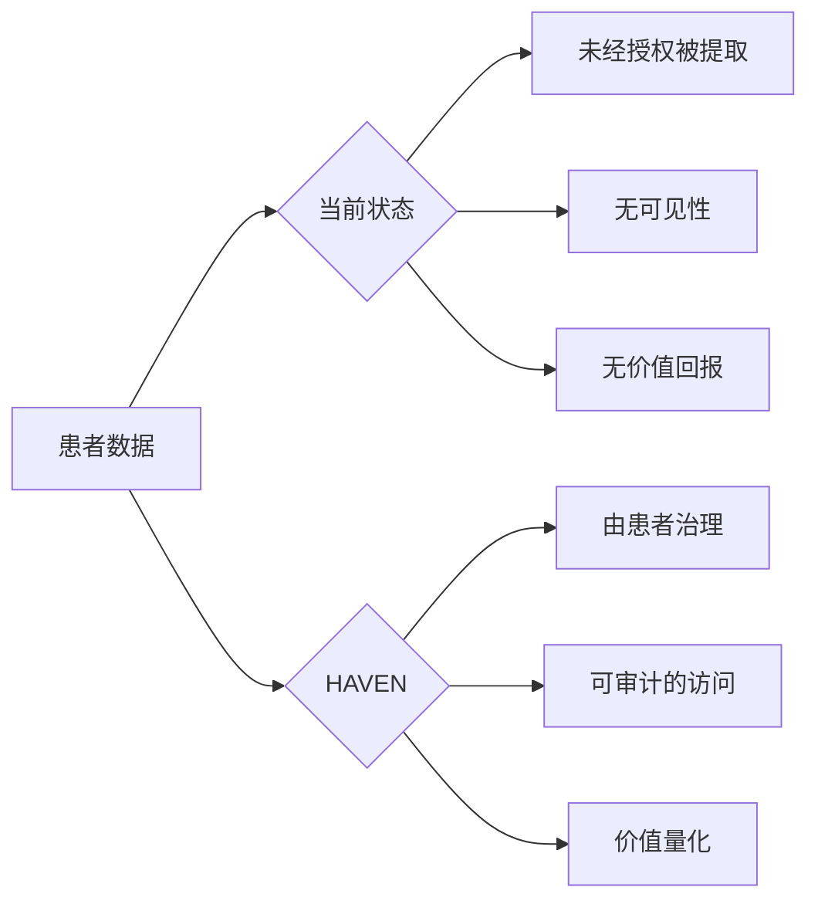
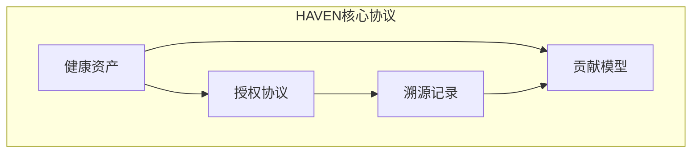
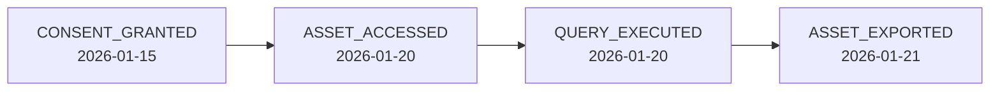
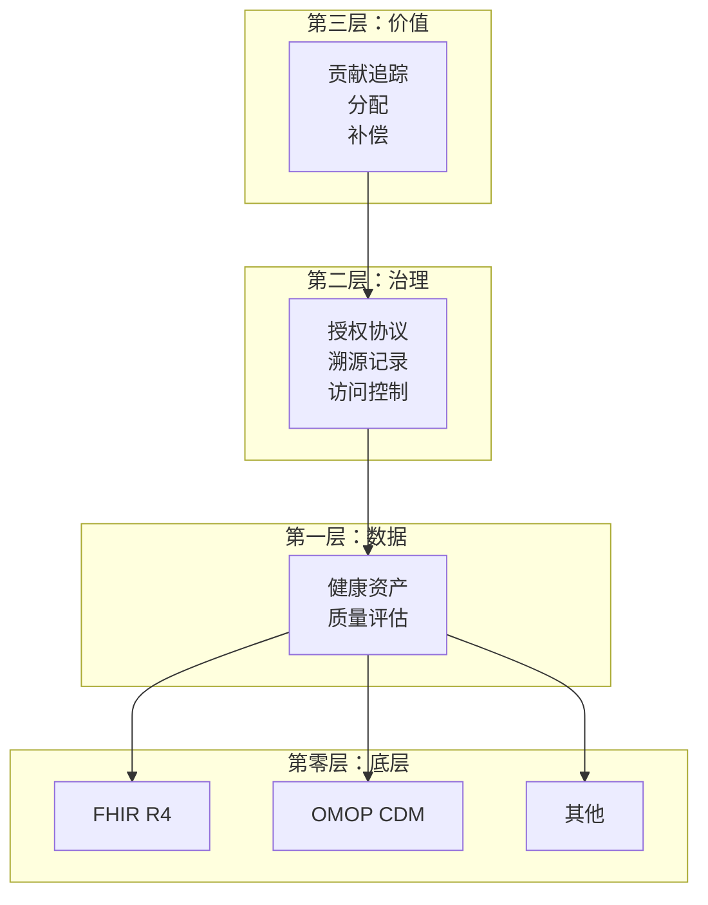
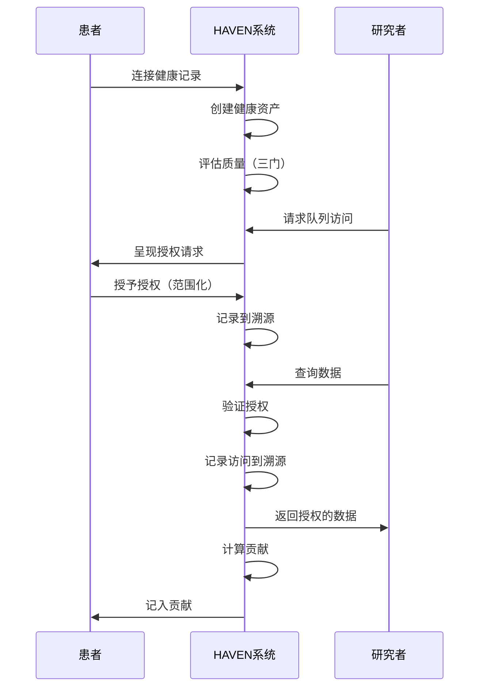

# HAVEN：患者主权健康数据协议

**版本 2.0 | 2026年1月**

---

## 摘要

HAVEN（健康资产价值与交换网络，Health Asset Value & Exchange Network）是一个患者主权生物医学数据协议。它定义了四个核心原语：**健康资产**（内容寻址的受治理数据对象）、**授权协议**（具有确定性评估的可编程授权）、**溯源记录**（哈希链式审计轨迹）和**贡献模型**（质量加权的价值量化）。

HAVEN建立在成熟标准（HL7 FHIR R4、OHDSI OMOP CDM）之上，将实现选择（存储后端、计算模型、用户界面）留给采用者。协议规范密码学完整性保证、授权验证语义和互操作性要求，同时对部署架构保持中立。

本白皮书定义HAVEN规范的内容及其刻意留给实现的内容。

---

## 目录

1. [引言](#1-引言)
2. [为何是现在](#2-为何是现在)
3. [相关工作](#3-相关工作)
4. [问题陈述](#4-问题陈述)
5. [设计原则](#5-设计原则)
6. [HAVEN核心协议](#6-haven核心协议)
7. [参考架构](#7-参考架构)
8. [基础标准](#8-基础标准)
9. [实现范围](#9-实现范围)
10. [结论](#10-结论)

---

## 1. 引言

生物医学数据正在成为塑造医学未来的AI系统的主要输入。基于临床记录训练的基础模型已在某些专业领域展现出超越人类专家的能力。

这造成了根本性的矛盾：**产生这些数据的患者对其使用没有治理权，对其流向没有可见性，对其创造的价值没有参与权。**

HAVEN提出：**患者数据主权作为基础设施**。



HAVEN不是一个应用程序。它是一个协议——一套使患者主权健康数据系统成为可能的规范。

---

## 2. 为何是现在

三股力量汇聚，使患者数据主权既可行又紧迫。

### 2.1 基础设施成熟

技术基础现已具备：

| 组件 | 状态 | 意义 |
|------|------|------|
| FHIR R4 | 广泛采用 | 健康数据交换的标准API |
| SMART on FHIR | 广泛采用 [1] | 基于OAuth 2.0的患者授权访问 |
| OMOP CDM | 9.74亿患者记录 [2] | 研究就绪的通用数据模型 |
| CMS法规 | 2021年起强制 | 电子健康数据的法定权利 |

过去的尝试因基础设施不存在而失败：
- **Microsoft HealthVault (2007-2019)**：因采用率低而关闭 [3]
- **Google Health 1.0 (2008-2012)**：停止运营，引用缺乏广泛使用 [4]

现在的不同：**标准是强制的，不是可选的**。

### 2.2 AI创造紧迫性

基础模型**正在**使用健康数据训练：

- **GPT-4** 使用未公开的医学语料库训练，没有患者授权机制 [5]
- **Med-PaLM 2** 在MedQA上达到86.5%准确率，使用临床数据集训练 [6]
- **PubMed** 包含3600万+文章，越来越多用于医学AI训练 [7]

全球临床试验市场：**2024年845.4亿美元**，预计到**2033年达1584.1亿美元** [8]。然而：

| 问题 | 数据 |
|------|------|
| 试验招募失败 | 80%的试验未能按时完成招募 [9] |
| 每患者成本 | 平均招募成本$6,533/患者 [10] |
| 数据获取时间 | 回顾性数据访问需6-18个月 [11] |
| 筛选失败率 | 25-50%的筛选患者不符合条件 [12] |

**窗口正在关闭。** 一旦模型在无治理数据上训练，溯源将永久丢失。

### 2.3 监管推动

| 法规 | 年份 | 影响 |
|------|------|------|
| 21世纪治愈法案 | 2016 | 禁止信息阻断；100万美元+罚款 |
| CMS互操作性规则 | 2021 | 强制患者访问理赔数据 |
| GDPR第20条 | 2018 | 数据可携带权作为基本权利 |
| HIPAA访问权 | 2019 | 30天响应要求；OCR执法 |

2024年执法：**HHS OCR发起22项HIPAA执法行动**，自2019年以来已发出超过50项访问权罚款 [13]。

监管者正在推动患者控制。HAVEN提供实现其意图的技术基础设施。

---

## 3. 相关工作

患者健康数据管理已有多种方案。HAVEN在范围和设计理念上有所不同。

| 方案 | 关注点 | HAVEN差异化 |
|------|--------|-------------|
| **Apple Health Records** | 通过SMART on FHIR聚合消费者数据 | 仅聚合；无授权协议、无研究市场、无贡献追踪 |
| **PicnicHealth** | 为研究收集医疗记录 | 中心化平台；患者不控制治理，授权是二元的 |
| **Ocean Protocol** | 去中心化数据市场 | 通用数据；无健康特定标准（FHIR/OMOP），无临床授权语义 |
| **Solid (Tim Berners-Lee)** | 个人数据Pod | 通用目的；无健康数据模型、无质量评估、无研究工作流 |
| **CommonHealth (Android)** | 健康数据API标准 | 设备级API；无授权协议、无溯源、无价值模型 |
| **TEFCA/Carequality** | 网络间数据交换 | 以机构为中心；患者不是数据控制者 |

**HAVEN的定位**：一个协议层，结合患者原生治理（如Solid的理念）、医疗特定标准（FHIR、OMOP）和研究就绪基础设施（授权语义、质量评分、贡献追踪）。

HAVEN不是平台或应用——它是使平台能够互操作同时保留患者主权的基础设施。

---

## 4. 问题陈述

HAVEN解决健康数据系统的四个结构性缺陷：

| 问题 | 描述 | HAVEN应对 |
|------|------|-----------|
| **没有治理的互操作性** | 数据在系统间流动；授权不随之传递 | 健康资产嵌入治理 |
| **静态授权** | 二元、粗粒度、永久 | 授权协议：动态、细粒度、可撤销 |
| **无审计轨迹** | 使用对患者不可见 | 溯源记录：仅追加日志 |
| **价值提取** | 患者被排斥在价值之外 | 贡献模型：量化、透明 |

---

## 5. 设计原则

六个原则指导HAVEN：

| 原则 | 含义 |
|------|------|
| **P1：患者原生主权** | 患者控制是基础，不是功能 |
| **P2：可编程治理** | 授权是待执行的策略，不是待签署的表格 |
| **P3：默认可审计** | 每次访问都创建记录 |
| **P4：贡献量化** | 患者价值是可测量的 |
| **P5：监管兼容** | 使合规成为可能，不替代法规 |
| **P6：实现无关** | 协议跨存储、计算、界面选择运行 |

---

## 6. HAVEN核心协议

HAVEN定义四个原语。其他一切都是实现选择。



### 6.1 健康资产

**健康资产**是受治理的数据引用——不是原始数据，而是带有嵌入式治理元数据的指针。

#### 规范

```
HealthAsset := {
    asset_id        : ContentHash      // 从内容派生
    data_ref        : SecureReference  // 指向临床数据的指针
    substrate       : Identifier       // 数据格式（FHIR、OMOP等）
    consent_ref     : ConsentID        // 活跃的授权策略
    quality_class   : {A, B, C, D}     // 数据质量等级
    provenance_ref  : ProvenanceID     // 审计链引用
    created_at      : Timestamp
}
```

#### 属性

1. **治理嵌入**：永远不是"裸"数据。授权引用是必需的——在协议层强制执行。
2. **内容寻址**：`asset_id`通过SHA-256内容哈希派生，确保不可变性并支持跨分布式系统的Merkle树验证。
3. **底层无关**：同一资产可有FHIR、OMOP或MEDS表示，通过概念映射保持语义等价。
4. **质量评分**：每个资产携带从三门验证协议派生的质量分类。

#### 示例

```json
{
  "asset_id": "sha256:a1b2c3...",
  "data_ref": "omop://person/12345/measurement/67890",
  "substrate": "OMOP-CDM-6.0",
  "consent_ref": "consent:98765",
  "quality_class": "A",
  "provenance_ref": "prov:chain:11111",
  "created_at": "2026-01-15T10:30:00Z"
}
```

---

### 6.2 授权协议

**授权协议**定义如何授予、验证和撤销授权。

#### 规范

```
ConsentAttestation := {
    consent_id      : UUID
    grantor         : PatientIdentity   // 谁授权
    grantee         : AccessorIdentity  // 谁接收
    scope           : DataScope         // 什么数据
    purpose         : PurposeType       // 为什么
    conditions      : Conditions[]      // 什么规则下
    granted_at      : Timestamp
    expires_at      : Timestamp | null
    status          : {active, revoked, expired}
    signature       : CryptoSignature
}

DataScope := {
    resource_types  : ResourceType[]    // 疾病、检验、药物等
    time_range      : TimeRange | null  // 历史范围
    exclusions      : ResourceType[]    // 明确排除
}
```

#### 操作

| 操作 | 描述 |
|------|------|
| `grant()` | 创建新的授权证明 |
| `verify()` | 检查访问是否被授权 |
| `revoke()` | 撤销授权（立即） |
| `list()` | 查看所有授权（患者透明度） |

#### 示例：研究授权

```yaml
consent:
  grantor: "patient:alice"
  grantee: "study:diabetes-cgm-2026"
  scope:
    resource_types: [Measurement, Condition, DrugExposure]
    time_range: {start: "2020-01-01", end: null}
    exclusions: [Note, Observation.mental_health]
  purpose: "RESEARCH"
  conditions:
    - type: "AGGREGATION_ONLY"
      min_cohort_size: 50
    - type: "NO_REIDENTIFICATION"
  expires_at: "2027-01-15"
```

**患者看到的内容**："我正在与糖尿病CGM研究分享我的检验、疾病和药物数据（但不包括心理健康记录）。他们只能在50人以上的聚合中使用。有效期一年。我可以随时撤销。"

#### 语义保证

1. **确定性评估**：相同输入始终产生相同授权决策
2. **即时撤销**：`revoke()`调用后，所有后续`verify()`返回denied
3. **封闭世界范围**：未明确授权的资源类型默认拒绝

#### PSDL：声明式策略语言

HAVEN推荐使用**[PSDL](https://github.com/Chesterguan/PSDL)**（患者场景定义语言，Patient Scenario Definition Language）作为授权策略和临床场景的规范语言。PSDL使授权逻辑**人类可读且机器可执行**。

**核心特性：**

| 特性 | 描述 |
|------|------|
| **声明式** | 表达*检测什么*，而非*如何计算* |
| **可审计** | 内嵌`intent`、`rationale`和`provenance` |
| **确定性** | 相同输入始终产生相同结果 |
| **可移植** | 同一场景可在FHIR、OMOP或其他底层上运行 |

**示例：用于队列匹配的临床场景**

```yaml
scenario: AKI_Early_Detection
version: "1.0.0"

audit:
  intent: "使用肌酐趋势检测早期急性肾损伤"
  rationale: "早期AKI检测可实现及时干预"
  provenance: "KDIGO急性肾损伤临床实践指南 (2012)"

signals:
  Cr:
    ref: creatinine
    concept_id: 3016723    # OMOP标准概念
    unit: mg/dL

trends:
  cr_delta_6h:
    expr: delta(Cr, 6h)
    description: "6小时内肌酐变化"

logic:
  aki_risk:
    when: cr_delta_6h > 0.3 AND last(Cr) > 1.5
    severity: high
    description: "早期AKI - 肌酐上升且升高"
```

**患者看到的内容**：相比不透明的算法，患者可以理解：
- *"这个场景检测早期肾损伤"*
- *"它查看我的肌酐在6小时内如何变化"*
- *"它基于KDIGO 2012临床指南"*

完整语法规范见[附录C：PSDL参考](#附录c-psdl参考)。

---

### 6.3 溯源记录

**溯源记录**是所有治理事件的仅追加审计轨迹。

#### 规范

```
ProvenanceEntry := {
    entry_id        : UUID
    timestamp       : Timestamp
    event_type      : EventType
    actor           : Identity
    subject         : AssetRef | ConsentRef
    details         : EventData
    previous_hash   : Hash          // 链接
    signature       : CryptoSignature
}

EventType := {
    ASSET_CREATED, ASSET_ACCESSED, ASSET_EXPORTED,
    CONSENT_GRANTED, CONSENT_VERIFIED, CONSENT_REVOKED,
    QUERY_EXECUTED, COMPUTATION_RUN
}
```

#### 属性

1. **仅追加**：条目不可修改或删除——通过哈希链完整性强制执行
2. **哈希链接**：每个条目引用前一条目的SHA-256哈希，形成类似区块链结构的Merkle链式审计日志，但无共识开销
3. **密码学签名**：所有条目携带来自执行主体的Ed25519或ECDSA签名
4. **可查询**：患者可通过认证API检索完整历史，O(log n)验证复杂度

#### 示例：访问日志



```json
{
  "entry_id": "prov:entry:555",
  "timestamp": "2026-01-20T14:30:00Z",
  "event_type": "ASSET_ACCESSED",
  "actor": "researcher:bob@stanford.edu",
  "subject": "asset:a1b2c3",
  "details": {
    "consent_ref": "consent:98765",
    "purpose": "diabetes-cgm-study",
    "access_type": "READ"
  },
  "previous_hash": "sha256:prev...",
  "signature": "sig:..."
}
```

---

### 6.4 贡献模型

**贡献模型**量化患者数据价值以实现公平分配。

#### 规范

```
Contribution := {
    patient_id      : PatientIdentity
    asset_refs      : AssetRef[]
    quality_score   : Float[0, 1]
    tier            : ContributionTier
    context         : UsageContext      // 研究、查询等
    timestamp       : Timestamp
}

ContributionTier := {
    PROFILE,        // 人口统计、基本信息
    STRUCTURED,     // 检验、药物、疾病
    LONGITUDINAL,   // 多年记录
    COMPLEX         // 笔记、影像、基因组
}
```

#### 质量评估

HAVEN定义三门质量协议：


| 门 | 检查项 | 失败结果 |
|------|--------|----------|
| 第0门：溯源 | 有效来源，哈希完整性 | 拒绝 |
| 第1门：结构 | 必需字段，有效代码 | C/D级 |
| 第2门：映射 | 标准概念，研究就绪 | B/C级 |

#### 示例：贡献计算

```
患者Alice贡献给研究X：
  - 3年检验数据（LONGITUDINAL层级）
  - A级质量（通过所有门）
  - 847项测量，23项疾病

贡献分数 = 层级权重 × 质量分数 × 数量归一化
         = 1.0 × 0.95 × 0.87
         = 0.83
```

具体权重由实现定义，允许适应不同的研究场景。

---

## 7. 参考架构

HAVEN采用**计算到数据**范式：原始生物医学数据保持在患者或机构控制下，查询和模型传输到授权的计算环境，而非数据传输到外部。

HAVEN推荐四层架构。实现可能有所不同。



### 数据流示例



---

## 8. 基础标准

HAVEN建立在成熟标准之上，而非从零开始。

| 基础 | 在HAVEN中的角色 | 采用规模 |
|------|----------------|----------|
| **FHIR R4** | 数据交换格式 | CMS强制要求；Epic、Cerner等所有主流EHR支持 [14] |
| **OMOP CDM** | 研究数据模型 | 54个国家544个数据库中9.74亿患者记录 [2] |
| **SMART on FHIR** | 授权框架 | 主流EHR（Epic、Cerner、Allscripts）；Apple Health Records集成 [1] |
| **OAuth 2.0 / OIDC** | 身份认证 | 行业标准；全球每日10亿+认证 |
| **内容寻址存储** | 资产完整性 | Git（1亿+仓库）、IPFS、区块链系统中验证 |

### 技术基础详情

**OMOP词汇表覆盖：**
- 100+词汇表中270,000+标准概念
- 95%+诊断代码的ICD-10 → SNOMED-CT映射
- 99%+美国处方药物的RxNorm覆盖
- 实验室观察的LOINC映射

**FHIR R4资源类型：**
HAVEN健康资产映射到FHIR资源，包括：`Patient`、`Condition`、`Observation`、`MedicationRequest`、`Procedure`、`DiagnosticReport`、`DocumentReference`。

### 为何重要

HAVEN不发明新的数据格式或重新发明身份认证。通过建立在成熟基础之上：

- **互操作性**：与现有医疗IT基础设施协作，无需系统替换
- **可信度**：基于有机构采用和监管支持的标准
- **可行性**：实现需要集成工程，而非突破性技术
- **网络效应**：利用现有OHDSI网络的330+研究数据库

---

## 9. 实现范围

HAVEN明确定义其规范的内容和留给实现的内容。

### HAVEN规范

| 组件 | 规范 |
|------|------|
| 健康资产结构 | 必需字段，内容寻址 |
| 授权协议 | 操作，证明格式，验证 |
| 溯源记录 | 事件类型，链接，签名 |
| 贡献模型 | 层级，质量门，评分接口 |

### 实现决定

| 选择 | 选项 | HAVEN立场 |
|------|------|-----------|
| **数据底层** | FHIR、OMOP、MEDS、自定义 | 任何符合标准的格式 |
| **存储** | PostgreSQL、MongoDB、区块链 | 协议无关 |
| **计算模型** | 集中式、联邦、飞地 | 只要授权被执行，皆有效 |
| **用户界面** | 移动应用、网页、纯API | 不规范 |
| **支付轨道** | 法币、加密货币、积分 | 实现选择 |
| **数据摄入** | Fasten、1upHealth、直接EHR | 任何合规来源 |

### 这意味着

一个HAVEN合规系统：

- ✅ 必须实现健康资产、授权、溯源、贡献原语
- ✅ 必须在数据访问前强制授权验证
- ✅ 必须维护仅追加溯源记录
- ⚪ 可以使用任何存储、计算或界面方案
- ⚪ 可以用额外功能扩展协议

---

## 10. 结论

HAVEN解决一个根本性的不对称：患者产生生物医学数据，但对其使用没有治理权。

**协议贡献**：四个原语——健康资产、授权协议、溯源记录、贡献模型——使患者主权可以实现。

**时机**：基础设施已成熟。AI正在训练。监管者在推动。患者数据主权的时刻是现在。

**方法**：建立在成熟标准（FHIR、OMOP）之上。规范核心协议。将实现选择留给采用者。

---

我们正在构建参考实现，以证明患者主权生物医学数据是可行的，而非理论的。

**联系方式**：chesterguan@prometheno.org

---

## 参考文献

[1] Mandel, J.C., et al. "SMART on FHIR: A standards-based, interoperable apps platform for electronic health records." *Journal of the American Medical Informatics Association* 23.5 (2016): 899-908.

[2] OHDSI. "OHDSI Network Statistics." Observational Health Data Sciences and Informatics, 2024. https://ohdsi.org/

[3] Microsoft. "HealthVault Service Discontinuation." Microsoft Health Blog, 2019.

[4] Google. "An update on Google Health and Google PowerMeter." Official Google Blog, 2011.

[5] OpenAI. "GPT-4 Technical Report." arXiv:2303.08774, 2023.

[6] Singhal, K., et al. "Towards Expert-Level Medical Question Answering with Large Language Models." arXiv:2305.09617, 2023.

[7] National Library of Medicine. "PubMed Overview." NIH, 2024. https://pubmed.ncbi.nlm.nih.gov/

[8] Grand View Research. "Clinical Trials Market Size Report, 2024-2032." 2024.

[9] Fogel, D.B. "Factors associated with clinical trials that fail and opportunities for improving the likelihood of success." *Contemporary Clinical Trials Communications* 11 (2018): 156-164.

[10] Sertkaya, A., et al. "Key cost drivers of pharmaceutical clinical trials in the United States." *Clinical Trials* 13.2 (2016): 117-126.

[11] TriNetX. "Real-World Data Access Benchmarks." 2023.

[12] Getz, K.A. "Examining and Enabling the Role of Health Care Providers as Patient Recruitment Partners." *Clinical Therapeutics* 39.11 (2017): 2244-2249.

[13] HHS Office for Civil Rights. "HIPAA Enforcement Highlights." 2024. https://www.hhs.gov/hipaa/

[14] HL7 International. "FHIR R4 Specification." https://hl7.org/fhir/R4/

[15] OHDSI. "OMOP Common Data Model v6.0." https://ohdsi.github.io/CommonDataModel/

[16] HIPAA Privacy Rule. 45 CFR Part 160 and Part 164.

[17] GDPR. Regulation (EU) 2016/679 of the European Parliament.

---

## 附录A：术语表

| 术语 | 定义 |
|------|------|
| 健康资产 | 带有治理元数据的患者数据对象 |
| 授权证明 | 签名的授权记录 |
| 溯源记录 | 仅追加的审计轨迹 |
| 贡献 | 量化的患者数据价值 |
| 质量等级 | A/B/C/D数据质量分类 |
| 底层 | 底层数据格式（FHIR、OMOP等） |

---

## 附录B：安全考虑（非规范性）

HAVEN实现应考虑以下威胁类别：

| 威胁 | 描述 |
|------|------|
| **未授权访问** | 绕过授权协议直接访问数据 |
| **溯源篡改** | 修改或删除审计轨迹条目 |
| **激励博弈** | 伪造质量分数或贡献指标 |
| **重新识别** | 通过聚合数据推断个体身份 |
| **授权范围蔓延** | 利用过宽的授权范围 |

具体缓解机制由实现定义。建议实现：

- 对所有授权证明使用密码学签名
- 实施查询的最小聚合阈值
- 采用哈希链确保溯源完整性
- 定期审计访问模式

本附录为非规范性内容。安全要求可能因司法管辖区和用例而异。

---

## 附录C：PSDL参考

**仓库**: https://github.com/Chesterguan/PSDL

PSDL（患者场景定义语言）是一种用于指定临床场景、授权策略和数据访问模式的声明式语言。

### 基本结构

```yaml
scenario: <场景名称>
version: "<语义化版本>"

# Audit块 - 解释意图和证据
audit:
  intent: "此场景检测什么"
  rationale: "为什么此检测重要"
  provenance: "临床指南或研究来源"

# Signals - 绑定临床数据引用
signals:
  <信号名>:
    ref: <临床概念>              # 如：creatinine, glucose, heart_rate
    concept_id: <omop_id>        # OMOP标准概念ID
    unit: <计量单位>             # 如：mg/dL, mmol/L

# Trends - 计算时序特征
trends:
  <趋势名>:
    expr: <时序表达式>
    description: "人类可读的解释"

# Logic - 定义检测规则
logic:
  <规则名>:
    when: <布尔表达式>
    severity: low | medium | high
    description: "此规则检测什么"

# Population（可选）- 患者纳入标准
population:
  age: "<条件>"                  # 如：">= 18"
  conditions: [<疾病列表>]       # 如：[diabetes, hypertension]
```

### 时序运算符

| 运算符 | 语法 | 描述 |
|--------|------|------|
| `delta` | `delta(signal, window)` | 时间窗口内的变化量 |
| `slope` | `slope(signal, window)` | 线性趋势方向 |
| `ema` | `ema(signal, window)` | 指数移动平均 |
| `last` | `last(signal)` | 最近值 |
| `min` | `min(signal, window)` | 窗口内最小值 |
| `max` | `max(signal, window)` | 窗口内最大值 |
| `count` | `count(signal, window)` | 观测数量 |

**窗口格式**：`30s`, `6h`, `24h`, `7d`, `30d`, `1y`

### 示例：糖尿病研究队列

```yaml
scenario: T2DM_CGM_Cohort
version: "1.0.0"

audit:
  intent: "识别适合CGM研究的2型糖尿病患者"
  rationale: "CGM研究需要确诊的T2DM且有近期HbA1c数据"
  provenance: "ADA糖尿病医疗标准 (2024)"

signals:
  HbA1c:
    ref: hemoglobin_a1c
    concept_id: 3004410
    unit: "%"

  glucose:
    ref: fasting_glucose
    concept_id: 3004501
    unit: mg/dL

population:
  age: ">= 30 AND <= 65"
  conditions: [type_2_diabetes]
  medications: [metformin]
  min_history: 365d

trends:
  hba1c_recent:
    expr: last(HbA1c)
    description: "最近的HbA1c"

  hba1c_trend:
    expr: slope(HbA1c, 180d)
    description: "6个月内HbA1c趋势"

logic:
  eligible:
    when: hba1c_recent >= 7.0 AND hba1c_recent <= 10.0
    description: "HbA1c在研究目标范围内"

  stable:
    when: abs(hba1c_trend) < 0.5
    description: "血糖控制相对稳定"

  cohort_match:
    when: eligible AND stable
    description: "符合CGM研究标准"
```

### 授权策略示例

```yaml
scenario: Research_Consent_Policy
version: "1.0.0"

audit:
  intent: "定义糖尿病研究的数据分享权限"
  rationale: "患者控制的、细粒度的研究参与授权"

scope:
  grant:
    - Measurement.laboratory
    - Condition.endocrine
    - DrugExposure.antidiabetic
  deny:
    - Note.*
    - Observation.mental_health

  time_range:
    start: "2020-01-01"
    end: null  # 持续有效

conditions:
  - type: AGGREGATION_ONLY
    min_cohort_size: 50
  - type: NO_REIDENTIFICATION
  - type: PURPOSE_RESTRICTED
    allowed: [RESEARCH, PUBLIC_HEALTH]

expiration: "2027-01-15"
revocable: true
```

### 执行语义

```
evaluate(scenario, patient_data) → {
    matched: boolean,
    triggered_rules: Rule[],
    confidence: float,
    audit_entry: ProvenanceEntry
}
```

**保证：**
1. **确定性**：同一场景 + 同一数据 = 同一结果
2. **可审计**：每次评估都创建溯源条目
3. **沙盒化**：场景无法访问声明的信号之外的数据

---

*HAVEN协议白皮书 v2.0 | 2026年1月*

*本文档采用知识共享署名4.0国际许可协议（CC BY 4.0）发布。*
