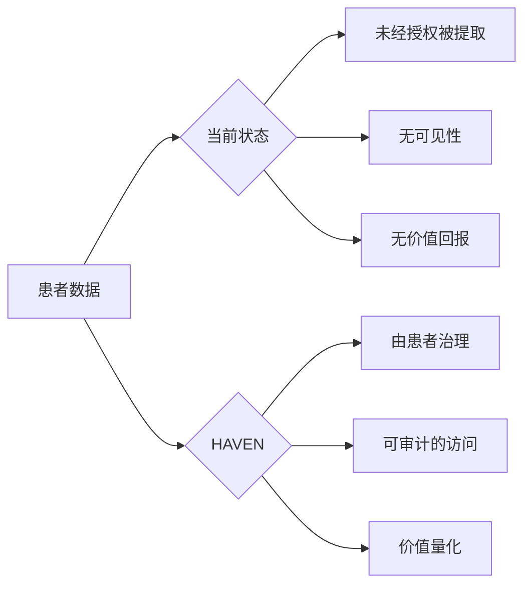
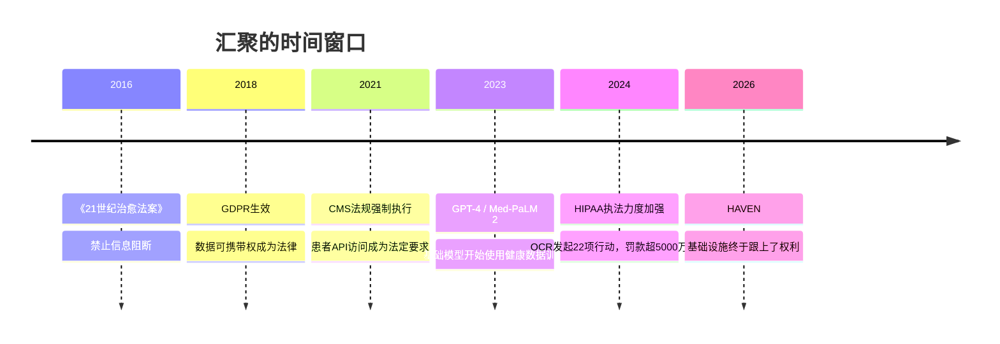
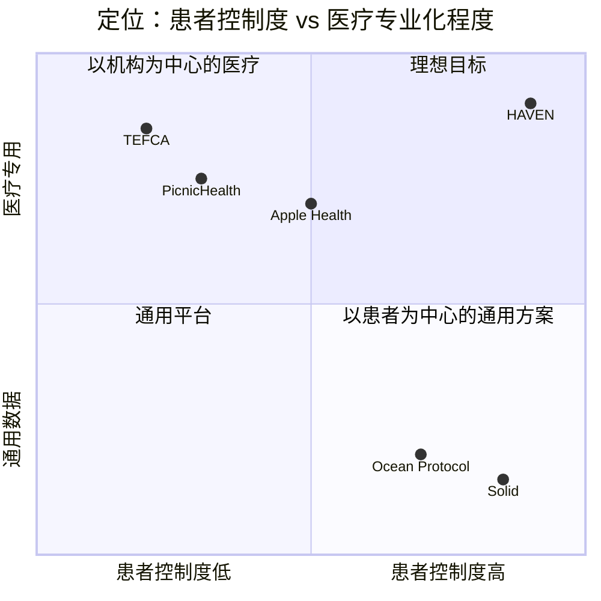
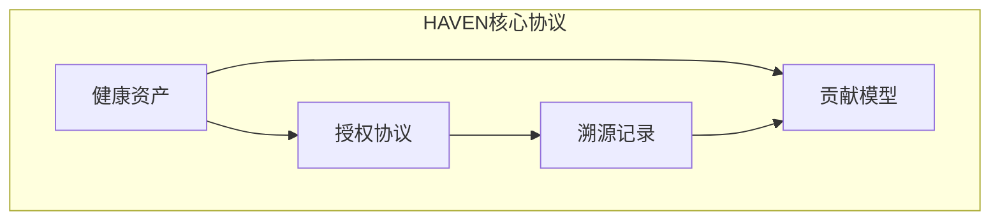
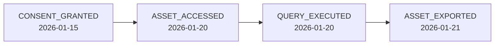
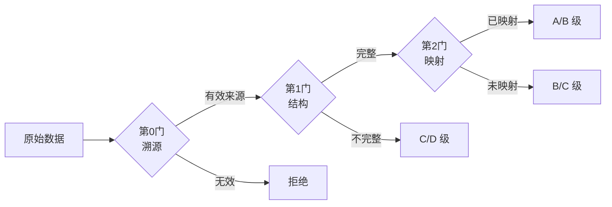
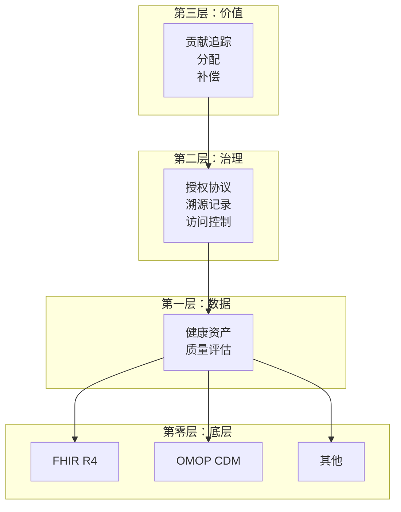
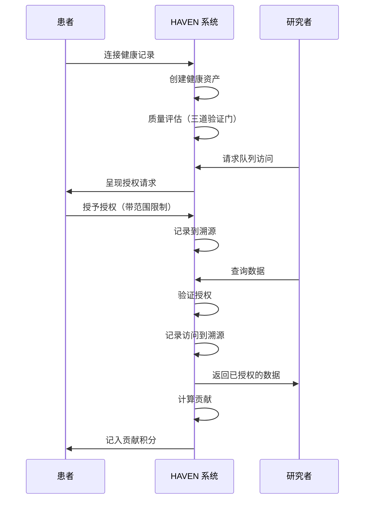

# HAVEN：患者健康数据价值交换协议

**版本 2.0 | 2026年2月**

---

## 摘要

HAVEN 是一个以患者为中心的健康数据协议。它规定了数据如何被引用、授权、审计和估值。它对数据存储方式、计算方式和支付方式没有任何规定。

协议包含四个部分：
- **健康资产**：携带内置治理规则的临床数据智能指针
- **授权协议**：患者真正能掌控的、机器可执行的授权机制
- **溯源记录**：无人能篡改的审计轨迹
- **贡献模型**：衡量患者数据价值的方法

我们基于 FHIR 和 OMOP 构建，因为它们已被广泛验证。存储、计算和经济模型留给实现方，因为没有一套方案能适配所有场景。

本文档解释 HAVEN 规范了什么——以及它刻意留白了什么。

---

## 目录

1. [引言](#1-引言)
2. [为何是现在](#2-为何是现在)
3. [相关工作](#3-相关工作)
4. [问题陈述](#4-问题陈述)
5. [设计原则](#5-设计原则)
6. [HAVEN核心协议](#6-haven核心协议)
7. [参考架构](#7-参考架构)
8. [基础标准](#8-基础标准)
9. [实现范围](#9-实现范围)
10. [结论](#10-结论)

---

## 1. 引言

你做过的每一次血液检查、每一张影像片子、每一份病历记录，都在悄悄成为你永远看不到的 AI 系统的训练数据。基础模型正在从患者记录中学习医学知识——在某些专科任务上已超越人类专家——而那些用自己的身体产生这些数据的人，对数据的用途却没有任何发言权。

现实就是这样：**你看不到谁查看了你的病历，你无法控制他们拿去做什么，你更不会从你的数据帮助产生的数十亿美元中分到一分钱。**

Shoshana Zuboff 将这种现象称为"监控资本主义"——人类的经验被当作免费原材料提取 [18]。Jaron Lanier 说得更直白：患者每次就医都在付出劳动，但财富流向了别处 [19]。

三百年前，John Locke 就提出，人们拥有自己劳动果实的所有权 [20]。如果你在日常生活中产生了健康数据——管理慢性病、按时就诊、忍受医疗的种种不便——你难道不应该对这些数据的命运有所掌控吗？

HAVEN 从一个简单的前提出发：**患者主权不是日后要添加的功能，而是整个体系的地基。**



你不会在应用商店里下载 HAVEN。它是一个协议——一套规范，让不同的系统能够协作，同时让患者保持掌控。

---

## 2. 为何是现在

患者数据主权在现代医疗的大多数时间里都是技术上不可能实现的。这一点已经改变。



### 2.1 基础设施终于到位了

十年前要做这件事，得说服每一家医院采用新标准。现在：

| 组件 | 状态 | 意义 |
|------|------|------|
| FHIR R4 | 广泛采用 | 健康数据交换的标准 API |
| SMART on FHIR | 广泛采用 [1] | 基于 OAuth 2.0 的患者授权访问 |
| OMOP CDM | 9.74 亿患者记录 [2] | 研究就绪的通用数据模型 |
| CMS 法规 | 2021年起强制执行 | 电子健康数据的法定权利 |

过去的尝试之所以失败，是因为基础设施还不存在：
- **Microsoft HealthVault（2007-2019）**：因采用率低而关闭 [3]
- **Google Health 1.0（2008-2012）**：停止运营，原因是缺乏广泛使用 [4]

现在的不同之处：**标准是强制要求，不是可选项**。

### 2.2 AI 没有在等

我们还在争论患者权利的时候，基础模型已经在用健康数据训练了：

- **GPT-4** 使用未公开的医学语料库训练，没有任何患者授权机制 [5]
- **Med-PaLM 2** 在 MedQA 上达到 86.5% 的准确率，使用临床数据集训练 [6]
- **PubMed** 收录了 3600 万篇以上的文章，越来越多地被用于医学 AI 训练 [7]

与此同时，临床试验——这个规模达 840 亿美元、预计到 2033 年将增长到 1580 亿美元的行业 [8]——正在被自身的低效拖垮：

| 问题 | 数据 |
|------|------|
| 试验招募失败 | 80% 的试验未能按时完成招募 [9] |
| 每患者成本 | 平均招募成本每患者 6,533 美元 [10] |
| 数据获取时间 | 回顾性数据访问需要 6-18 个月 [11] |
| 筛选失败率 | 25-50% 的筛选患者不符合入组条件 [12] |

**窗口正在关闭。** 一旦模型在无治理的数据上完成训练，溯源就永久消失了。

### 2.3 监管机构已经不再等待

| 法规 | 年份 | 影响 |
|------|------|------|
| 《21世纪治愈法案》 | 2016 | 禁止信息阻断；罚款 100 万美元以上 |
| CMS 互操作性规则 | 2021 | 强制要求患者访问理赔数据 |
| GDPR 第 20 条 [17] | 2018 | 数据可携带权作为基本权利 |
| HIPAA 访问权 [16] | 2019 | 30 天响应要求；OCR 执法 |

2024 年执法情况：**HHS OCR 发起了 22 项 HIPAA 执法行动**，自 2019 年以来已发出超过 50 项访问权罚款 [13]。

患者控制权的法律框架来得比支撑它的技术基础设施还要快。HAVEN 填补的正是这个空缺。

---

## 3. 相关工作

已经有人尝试过解决这个问题。我们来说说他们为什么没能做到——以及 HAVEN 有什么不同。

| 方案 | 关注点 | HAVEN 的差异化 |
|------|--------|----------------|
| **Apple Health Records** | 通过 SMART on FHIR 聚合消费者数据 | 只是聚合；没有授权协议，没有研究市场，没有贡献追踪 |
| **PicnicHealth** | 为研究收集医疗记录 | 中心化平台；患者不控制治理，授权是非此即彼的 |
| **Ocean Protocol** | 去中心化数据市场 | 通用数据定位；没有健康特定标准（FHIR/OMOP），没有临床授权语义 |
| **Solid（Tim Berners-Lee）** | 个人数据 Pod | 通用目的；没有健康数据模型，没有质量评估，没有研究工作流 |
| **CommonHealth（Android）** | 健康数据 API 标准 | 设备级 API；没有授权协议，没有溯源，没有价值模型 |
| **TEFCA/Carequality** | 网络间数据交换 | 以机构为中心；患者不是数据控制方 |

#### 能力对比

|  | 患者控制 | 授权粒度 | 审计轨迹 | 价值追踪 | 健康标准 | 研究就绪 |
|--|:--:|:--:|:--:|:--:|:--:|:--:|
| **HAVEN** | ●●●● | ●●●● | ●●●● | ●●●● | ●●●● | ●●●● |
| Apple Health | ●●○○ | ●○○○ | ●○○○ | ○○○○ | ●●●○ | ○○○○ |
| PicnicHealth | ●○○○ | ●○○○ | ●●○○ | ●○○○ | ●●●○ | ●●●○ |
| Ocean Protocol | ●●●○ | ●●○○ | ●●●○ | ●●●○ | ○○○○ | ●○○○ |
| Solid | ●●●● | ●●○○ | ●●○○ | ○○○○ | ○○○○ | ○○○○ |
| TEFCA | ●○○○ | ●○○○ | ●●○○ | ○○○○ | ●●●● | ●●○○ |



**HAVEN 的定位**：我们借鉴了 Solid 的核心理念（患者拥有自己的数据），并让它真正适用于医疗场景。这意味着支持 FHIR 和 OMOP，处理医疗数据特有的授权需求，以及用研究人员真正关心的方式追踪数据质量。

这不是一个你能下载的应用。它是让不同应用能够协同工作的底层管道，不会让任何一方失去对数据的掌控。

---

## 4. 问题陈述

现代医疗 IT 解决了互操作性问题，却忘记了患者这个人。四个顽疾依然存在：

| 问题 | 描述 | HAVEN 的应对 |
|------|------|-------------|
| **没有治理的互操作性** | 数据在系统间流动，授权却不随之传递 | 健康资产内嵌治理规则 |
| **静态授权** | 非此即彼、粒度粗糙、一经签署永久有效 | 授权协议：动态、细粒度、可撤销 |
| **没有审计轨迹** | 数据使用情况对患者完全不可见 | 溯源记录：仅追加日志 |
| **价值被榨取** | 患者被排除在数据价值之外 | 贡献模型：量化、透明 |

---

## 5. 设计原则

我们做了选择。这是我们相信的东西：

**患者控制优先。** 不是日后要添加的功能，而是架构的地基。其他一切都从这里延伸。

**授权应该是代码，而不是文书。** 一张签了字放在档案柜里的表格帮不了任何人。授权需要机器可读、机器可执行，并且可以实时撤销。

**每次访问都留下痕迹。** 没有静默读取，没有隐形查询。只要有人动了数据，这个事实就会被记录下来。

**患者的价值贡献应该可以衡量。** 如果数据有价值，我们就应该能量化谁贡献了什么。

**与监管机构协作，而非绕道而行。** HAVEN 帮你遵守 HIPAA 和 GDPR，不是替代法律要求，而是让合规变得更容易。

**不绑定技术选型。** 用你想用的数据库，部署在你想要的地方。协议对此不关心。

这些不是什么新鲜想法。Beauchamp 和 Childress 早在 1979 年就奠定了伦理框架：**自主、行善、无害、公正** [21]。HAVEN 只是把这些原则转化成了技术要求：

| HAVEN 原则 | 伦理依据 |
|------------|---------|
| 患者原生主权 | **自主**：尊重患者的自我决定权 |
| 默认可审计 | **无害**：通过透明度防止隐蔽伤害 |
| 贡献量化 | **公正**：公平分配利益与负担 |
| 监管兼容 | **行善**：在法律框架内推动良善结果 |

Lawrence Lessig 说得简洁："代码即法律" [22]。我们做出的技术选择，无论承不承认，都在编码价值观。HAVEN 明确选择患者主权。这不是我们要绕过的约束——而是我们的出发点。

---

## 6. HAVEN核心协议

HAVEN 刻意保持精简。四个原语，规范严格。其他一切——如何存储数据、运行计算、处理支付——都是你需要自己解决的问题。



**它们如何关联：**
- 每个**健康资产**都需要一个**授权**引用（不存在"裸"数据）
- 每次**授权**操作都会创建一条**溯源**记录（审计轨迹）
- **贡献**通过**溯源**追踪归因，从**资产**计算价值

### 6.1 健康资产

把健康资产想象成临床数据的"智能指针"。它不是数据本身——而是一个携带自身治理规则的引用。不经过附着在资产上的授权和审计机制，你就无法触及底层数据。

#### 规范

```
HealthAsset := {
    asset_id        : ContentHash      // 从内容派生
    data_ref        : SecureReference  // 指向临床数据的指针
    substrate       : Identifier       // 数据格式（FHIR、OMOP 等）
    consent_ref     : ConsentID        // 当前生效的授权策略
    quality_class   : {A, B, C, D}     // 数据质量等级
    provenance_ref  : ProvenanceID     // 审计链引用
    patient_ref     : PatientID        // 数据所有者
    created_at      : Timestamp
}
```

#### 它为什么能运作

不带授权引用，就无法创建健康资产。协议直接拒绝。这不是策略选择——是在数据结构层面强制执行的。

`asset_id` 来自对内容的哈希计算（SHA-256），所以只要有人篡改数据，ID 就不再匹配。和 Git 用的是同一个技巧。资产可以以 FHIR、OMOP 或你的系统需要的任何格式存在——语义映射负责翻译。每个资产都会根据通过质量验证门的情况获得一个质量等级（A 到 D）。

#### 示例

```json
{
  "asset_id": "sha256:a1b2c3...",
  "data_ref": "omop://person/12345/measurement/67890",
  "substrate": "OMOP-CDM-6.0",
  "consent_ref": "consent:98765",
  "quality_class": "A",
  "provenance_ref": "prov:chain:11111",
  "patient_ref": "patient:alice-12345",
  "created_at": "2026-01-15T10:30:00Z"
}
```

---

### 6.2 授权协议

现在的授权是一场骗局：你签了一份没读完的 40 页表格，授出了你无法撤回的永久权利，用于你永远不会知道的数据用途。HAVEN 的授权协议把授权变成真正有效的东西。

#### 规范

```
ConsentAttestation := {
    consent_id      : UUID
    grantor         : PatientIdentity   // 谁授权
    grantee         : AccessorIdentity  // 谁接收
    scope           : DataScope         // 什么数据
    purpose         : PurposeType       // 为什么
    conditions      : Conditions[]      // 在什么规则下
    granted_at      : Timestamp
    expires_at      : Timestamp | null
    status          : {active, revoked, expired}
    signature       : CryptoSignature
}

DataScope := {
    resource_types  : ResourceType[]    // 疾病、检验、药物等
    time_range      : TimeRange | null  // 历史数据范围
    exclusions      : ResourceType[]    // 明确排除的类型
}
```

#### 操作

| 操作 | 描述 |
|------|------|
| `grant()` | 创建新的授权证明 |
| `verify()` | 检查访问是否获得授权 |
| `revoke()` | 撤销授权（立即生效） |
| `list()` | 查看所有授权（为患者提供透明度） |

#### 示例：研究授权

```yaml
consent:
  grantor: "patient:alice"
  grantee: "study:diabetes-cgm-2026"
  scope:
    resource_types: [Measurement, Condition, DrugExposure]
    time_range: {start: "2020-01-01", end: null}
    exclusions: [Note, Observation.mental_health]
  purpose: "RESEARCH"
  conditions:
    - type: "AGGREGATION_ONLY"
      min_cohort_size: 50
    - type: "NO_REIDENTIFICATION"
  expires_at: "2027-01-15"
```

**患者看到的内容**："我正在与糖尿病 CGM 研究分享我的检验、诊断和用药数据（不含心理健康记录）。他们只能在 50 人以上的汇总数据中使用。有效期一年。我可以随时撤销。"

#### 协议保证什么

用相同的输入运行两次授权验证，你会得到相同的答案。没有随机性，没有"视情况而定"。这对审计至关重要。

患者撤销授权，立即生效。不是"24 小时内"，不是"下次同步后"。下一次 `verify()` 调用直接返回拒绝。就这么简单。

我们使用封闭世界语义：如果你没有明确授权访问某种资源类型，答案就是否。沉默意味着拒绝，不代表许可。

#### 为什么这很重要

这些想法不是我们发明的。纳粹医学实验之后，《纽伦堡守则》（1947 年）确立了自愿知情同意不是可选项，而是伦理基础 [23]。《贝尔蒙特报告》（1979 年）将此原则固化为现代研究规范 [24]。我们只是让这些原则变得可执行。

Helen Nissenbaum 的"情境完整性"框架解释了为什么现有授权机制总是失灵 [25]：在一个情境中恰当的信息流动（把症状告诉医生），在另一个情境中就成了侵犯（这些数据去训练广告模型）。HAVEN 强制执行情境边界。为研究分享的数据，就只用于研究。没有例外。

#### PSDL：声明式策略语言（可选）

HAVEN 推荐使用 **[PSDL](https://github.com/Chesterguan/PSDL)**（患者场景定义语言）来表达授权策略和临床场景。PSDL **可选但推荐**，适合希望使用人类可读、机器可执行授权逻辑的实现。

**为什么选 PSDL？** 相比不透明的算法，患者可以真正理解自己的授权：
- *"这个授权把我的检验数据分享给糖尿病研究"*
- *"他们只能在 50 人以上的汇总中使用"*
- *"基于 ADA 临床指南"*

相同输入，相同输出，每次如此——而且你可以追溯到底是为什么做出了某个决定。详见[附录C：PSDL参考](#附录c-psdl参考)。

---

### 6.3 溯源记录

现在，你完全不知道上周二是谁查看了你的病历。溯源记录解决这个问题——每一次访问、每一次查询、每一次导出，都记录在一个仅追加的日志里。没有人能抹去自己的痕迹。

#### 规范

```
ProvenanceEntry := {
    entry_id        : UUID
    timestamp       : Timestamp
    event_type      : EventType
    actor           : Identity
    subject         : AssetRef | ConsentRef
    details         : EventData
    previous_hash   : Hash          // 链式连接
    signature       : CryptoSignature
}

EventType := {
    ASSET_CREATED, ASSET_ACCESSED, ASSET_EXPORTED,
    CONSENT_GRANTED, CONSENT_VERIFIED, CONSENT_REVOKED,
    QUERY_EXECUTED, COMPUTATION_RUN
}
```

#### 它如何保持诚实

条目一旦写入，就永久留存。不可修改，不可删除。每条记录都包含前一条的哈希值，所以篡改历史就会破坏链条——你得重写它之后的所有内容。（对，和区块链一个道理，但没有共识机制的那些开销。）

每条记录都经过签名——Ed25519 或 ECDSA，随你选择。签名把每个操作绑定到特定的操作者身上。患者可以通过认证 API 拉取完整历史。验证复杂度是 O(log n)——不需要重放整条链就能校验单条记录。

#### 示例：访问日志



```json
{
  "entry_id": "prov:entry:555",
  "timestamp": "2026-01-20T14:30:00Z",
  "event_type": "ASSET_ACCESSED",
  "actor": "researcher:bob@stanford.edu",
  "subject": "asset:a1b2c3",
  "details": {
    "consent_ref": "consent:98765",
    "purpose": "diabetes-cgm-study",
    "access_type": "READ"
  },
  "previous_hash": "sha256:prev...",
  "signature": "sig:..."
}
```

---

### 6.4 贡献模型

如果患者数据有价值——而它显然有，看看流经健康数据经济的数十亿美元就知道——那么患者就应该分享其中一部分。贡献模型建立了实现这一目标所需的会计体系。

#### 规范

```
Contribution := {
    patient_id      : PatientIdentity
    asset_refs      : AssetRef[]
    quality_score   : Float[0, 1]
    tier            : ContributionTier
    context         : UsageContext      // 研究、查询等
    timestamp       : Timestamp
}

ContributionTier := {
    PROFILE,        // 人口统计、基本信息
    STRUCTURED,     // 检验、药物、诊断
    LONGITUDINAL,   // 多年连续记录
    COMPLEX         // 病历、影像、基因组
}
```

#### 质量评估

HAVEN 定义了三道质量验证门：



| 验证门 | 检查项 | 失败结果 |
|--------|--------|---------|
| 第0门：溯源 | 有效来源，哈希完整性 | 直接拒绝 |
| 第1门：结构 | 必需字段，有效代码 | C/D 级 |
| 第2门：映射 | 标准概念，研究就绪 | B/C 级 |

#### 质量分数计算

每道验证门都对综合质量分数有所贡献：

```
质量分数 = G₀ × (w₁·G₁ + w₂·G₂)

其中：
  G₀ = 溯源门（二元：0 或 1）
  G₁ = 结构完整性（0.0 到 1.0）
  G₂ = 概念映射覆盖率（0.0 到 1.0）
  w₁ = 0.4（结构权重）
  w₂ = 0.6（映射权重）
```

质量等级由分数决定：

| 质量分数 | 等级 | 含义 |
|---------|------|------|
| ≥ 0.90 | A | 研究级，完整映射 |
| 0.75 – 0.89 | B | 质量良好，有少量缺口 |
| 0.50 – 0.74 | C | 可用，但有局限 |
| < 0.50 | D | 使用价值有限 |

若 G₀ = 0（溯源验证失败），资产被直接拒绝，不分配分数。

#### 示例：贡献计算

```
患者 Alice 向研究 X 贡献数据：
  - 3 年检验数据（LONGITUDINAL 层级）
  - 质量等级 A（通过全部验证门）
  - 847 项测量，23 项诊断

贡献分数 = 层级权重 × 质量分数 × 数量归一化
         = 1.0 × 0.95 × 0.87
         = 0.83
```

这个分数（0.0 到 1.0）是一个相对权重，不是金额。如果 Alice 得了 0.83，Bob 得了 0.41，那么 Alice 对该研究的贡献大约是 Bob 的两倍。这对应多少钱？那是你、你的用户和你的商业模式之间的事。

我们提供的权重是起点，不是终点。基因组学研究对 COMPLEX 层级数据的估值，可能和人口健康调查完全不同。请根据实际需求调整。

#### 更难的问题：什么才算公平？

当许多人共同贡献时，如何公平分配价值是一个真正困难的问题。Rawls 认为，不平等只有在有助于处境最差的人时才说得通 [26]。放到健康数据的语境里：患者承担了真实的风险（隐私泄露、歧视、保险后果）。他们也应该分享真实的收益。

Elinor Ostrom 凭借一项发现摘得诺贝尔奖：社区可以在不把资源私有化、也不交给国家的情况下，有效管理共享资源 [27]。患者数据完全符合这个模型：一种**受治理的公共资源**。不是锁起来不让用（那对谁都没好处），也不是随意榨取（那只对患者以外的所有人有好处）。而是通过授权和透明核算，由社区共同管理。

---

## 7. 参考架构

你可以用多种方式构建符合 HAVEN 规范的系统：中心化数据湖、联邦网络、让查询旅行而非数据旅行的计算到数据架构。我们都不在乎。协议规定的是数据结构和语义——如何部署是你的事。

以下是理解各层次的一种方式（但不要把它当圣经）：



### 数据流示例

以下是一种可能的工作方式（你的实现可能不同——也许数据保持加密状态，只有患者能解锁，或者查询旅行到数据那里而不是反过来）：



---

## 8. 基础标准

我们不打算发明新标准。医疗领域已经有太多这种东西了。HAVEN 驾驭那些已经奏效的东西：

| 基础 | 在 HAVEN 中的角色 | 采用规模 |
|------|-----------------|---------|
| **FHIR R4** | 数据交换格式 | CMS 强制要求；Epic、Cerner 等所有主流 EHR 支持 [14] |
| **OMOP CDM** | 研究数据模型 | 54 个国家 544 个数据库中的 9.74 亿患者记录 [2][15] |
| **SMART on FHIR** | 授权框架 | 主流 EHR（Epic、Cerner、Allscripts）；Apple Health Records 集成 [1] |
| **OAuth 2.0 / OIDC** | 身份认证 | 行业标准；全球每日 10 亿次以上认证 |
| **内容寻址存储** | 资产完整性 | 已在 Git（1 亿以上仓库）、IPFS、区块链系统中验证 |

### 技术基础详情

**OMOP 词汇表覆盖范围：**
- 100 多个词汇表中的 27 万以上标准概念
- ICD-10 → SNOMED-CT 映射覆盖 95% 以上诊断代码
- RxNorm 覆盖 99% 以上美国处方药
- 实验室观测的 LOINC 映射

**FHIR R4 资源类型：**
HAVEN 健康资产映射到 FHIR 资源，包括：`Patient`、`Condition`、`Observation`、`MedicationRequest`、`Procedure`、`DiagnosticReport`、`DocumentReference`。

### 为什么这很重要

医疗行业不需要另一种强迫所有人扔掉现有系统的私有格式。HAVEN 插入已有的基础设施——你的 Epic 实例、你的 OMOP 数据仓库、你现有的认证体系。这些标准有机构背书和监管支持。你不需要等待技术突破；这是集成工程。而且已经有 330 多个数据库在使用 OMOP，你不是从零开始。

---

## 9. 实现范围

有些事我们有立场，有些事我们刻意保持沉默。界线在这里。

### HAVEN 规范的内容

| 组件 | 规范 |
|------|------|
| 健康资产结构 | 必需字段、内容寻址、质量等级 |
| 授权协议 | 操作、证明格式、验证算法 |
| 溯源记录 | 事件类型、哈希链接、Merkle 证明 |
| 贡献模型 | 层级、质量门、价值计算公式 |
| 交换包 | 在 HAVEN 合规系统间传输数据的互操作格式 |

**注意**：四个原语（健康资产、授权、溯源、贡献）构成核心协议。交换包是支撑 HAVEN 合规系统之间数据传输的基础设施。

### 实现方决定的内容

| 选择 | 选项 | HAVEN 的立场 |
|------|------|-------------|
| **数据底层** | FHIR、OMOP、MEDS、自定义 | 任何符合标准的格式都行 |
| **存储** | PostgreSQL、MongoDB、区块链 | 与协议无关 |
| **计算模型** | 中心化、联邦、飞地 | 只要授权被执行，都有效 |
| **用户界面** | 移动应用、网页、纯 API | 不做规定 |
| **支付轨道** | 法币、加密货币、积分 | 实现方自己决定 |
| **数据摄入** | Fasten、1upHealth、直接 EHR | 任何合规来源 |
| **加密方案** | AES、ChaCha20 等 | 实现方自己决定 |
| **密钥管理** | 托管、自主主权、社交恢复 | 实现方自己决定 |
| **身份验证** | KYC、DID、OAuth 等 | 实现方自己决定 |

### 经济模型：刻意开放

我们知道怎么衡量贡献。我们不打算告诉你怎么付钱。

HAVEN 提供核算方式：`价值 = 层级权重 × 质量分数 × 数量归一化`。参考权重和质量阈值在规范里。但支付轨道？市场设计？代币经济学？那些是你要搞定的。

这不是在逃避责任。这是因为正确的经济模型取决于场景——学术研究、商业临床试验和患者权益倡导组织需要不同的方式。HAVEN 给他们一种共同的价值语言；用这种语言怎么赚钱，他们自己决定。

### 这意味着什么

一个 HAVEN 合规系统：

- ✅ 必须实现健康资产、授权、溯源、贡献四个原语
- ✅ 必须在数据访问前强制执行授权验证
- ✅ 必须维护仅追加的溯源记录
- ✅ 必须支持交换包格式以实现互操作
- ⚪ 可以使用任何存储、计算或界面方案
- ⚪ 可以实现任何经济分配模型
- ⚪ 可以用额外功能扩展协议

### 可选扩展

- **PSDL**（患者场景定义语言）：用于授权和临床场景的声明式策略语言。推荐但非必须。详见 [github.com/Chesterguan/PSDL](https://github.com/Chesterguan/PSDL)。

### 我们不打算做的事

范围蔓延会毁掉一个协议。以下是 HAVEN 刻意不碰的东西：

- **合规性**：HAVEN 帮你遵守 HIPAA/GDPR。它替代不了你的律师。
- **市场**：我们衡量价值。我们不构建支付系统。
- **用户界面**：患者和研究者怎么交互？那是你的问题。
- **新数据格式**：我们用 FHIR 和 OMOP。我们不发明新标准。
- **技术选型**：没有区块链要求，没有云厂商绑定，对你用什么数据库没有意见。
- **身份验证**：怎么确认患者是他们声称的那个人，由你决定。

---

## 10. 结论

患者今天得到的交易很糟糕：产生数据，承担风险，得不到任何价值。HAVEN 不靠更好的初衷或更严的监管来解决这个问题。它靠基础设施。

四个原语。协议就这么多：健康资产、授权协议、溯源记录、贡献模型。足以让患者主权在技术上可以强制执行。又不足以把任何人锁定在特定实现里。

时机很重要。FHIR 和 OMOP 已经是强制要求或广泛采用的标准。基础模型现在就在使用健康数据训练。监管机构在用真实罚款执行患者访问权。构建这套基础设施的窗口是开着的——但不会永远开着。

---

我们正在构建参考实现，以证明这行得通。如果你对患者主权健康数据感兴趣，欢迎联系。

**联系方式**：chesterfield199512@gmail.com

---

## 参考文献

[1] Mandel, J.C., et al. "SMART on FHIR: A standards-based, interoperable apps platform for electronic health records." *Journal of the American Medical Informatics Association* 23.5 (2016): 899-908.

[2] OHDSI. "OHDSI Network Statistics." Observational Health Data Sciences and Informatics, 2024. https://ohdsi.org/

[3] Microsoft. "HealthVault Service Discontinuation." Microsoft Health Blog, 2019.

[4] Google. "An update on Google Health and Google PowerMeter." Official Google Blog, 2011.

[5] OpenAI. "GPT-4 Technical Report." arXiv:2303.08774, 2023.

[6] Singhal, K., et al. "Towards Expert-Level Medical Question Answering with Large Language Models." arXiv:2305.09617, 2023.

[7] National Library of Medicine. "PubMed Overview." NIH, 2024. https://pubmed.ncbi.nlm.nih.gov/

[8] Grand View Research. "Clinical Trials Market Size Report, 2024-2032." 2024.

[9] Fogel, D.B. "Factors associated with clinical trials that fail and opportunities for improving the likelihood of success." *Contemporary Clinical Trials Communications* 11 (2018): 156-164.

[10] Sertkaya, A., et al. "Key cost drivers of pharmaceutical clinical trials in the United States." *Clinical Trials* 13.2 (2016): 117-126.

[11] TriNetX. "Real-World Data Access Benchmarks." 2023.

[12] Getz, K.A. "Examining and Enabling the Role of Health Care Providers as Patient Recruitment Partners." *Clinical Therapeutics* 39.11 (2017): 2244-2249.

[13] HHS Office for Civil Rights. "HIPAA Enforcement Highlights." 2024. https://www.hhs.gov/hipaa/

[14] HL7 International. "FHIR R4 Specification." https://hl7.org/fhir/R4/

[15] OHDSI. "OMOP Common Data Model v6.0." https://ohdsi.github.io/CommonDataModel/

[16] HIPAA Privacy Rule. 45 CFR Part 160 and Part 164.

[17] GDPR. Regulation (EU) 2016/679 of the European Parliament.

[18] Zuboff, S. *The Age of Surveillance Capitalism: The Fight for a Human Future at the New Frontier of Power.* PublicAffairs, 2019.

[19] Lanier, J. *Who Owns the Future?* Simon & Schuster, 2013.

[20] Locke, J. *Two Treatises of Government.* 1689.（第五章：《论财产》）

[21] Beauchamp, T.L., and Childress, J.F. *Principles of Biomedical Ethics.* 第 8 版，Oxford University Press, 2019.（初版 1979）

[22] Lessig, L. *Code: Version 2.0.* Basic Books, 2006.

[23] "The Nuremberg Code." *Trials of War Criminals before the Nuremberg Military Tribunals.* U.S. Government Printing Office, 1949.（原发布于 1947 年）

[24] National Commission for the Protection of Human Subjects of Biomedical and Behavioral Research. *The Belmont Report: Ethical Principles and Guidelines for the Protection of Human Subjects of Research.* U.S. Department of Health, Education, and Welfare, 1979.

[25] Nissenbaum, H. "Privacy as Contextual Integrity." *Washington Law Review* 79.1 (2004): 119-158.

[26] Rawls, J. *A Theory of Justice.* Harvard University Press, 1971.

[27] Ostrom, E. *Governing the Commons: The Evolution of Institutions for Collective Action.* Cambridge University Press, 1990.

---

## 附录A：术语表

| 术语 | 定义 |
|------|------|
| 健康资产 | 携带治理元数据的患者数据对象 |
| 授权证明 | 签名的授权记录 |
| 溯源记录 | 仅追加的审计轨迹 |
| 贡献 | 量化的患者数据价值 |
| 质量等级 | A/B/C/D 数据质量分类 |
| 底层 | 底层数据格式（FHIR、OMOP 等） |

---

## 附录B：安全考虑（非规范性）

HAVEN 实现应考虑以下威胁类别：

| 威胁 | 描述 |
|------|------|
| **未授权访问** | 绕过授权协议直接访问数据 |
| **溯源篡改** | 修改或删除审计轨迹条目 |
| **激励博弈** | 伪造质量分数或贡献指标 |
| **重新识别** | 通过聚合数据推断个体身份 |
| **授权范围蔓延** | 利用过宽的授权范围 |

具体缓解机制由实现方定义。建议实现方：

- 对所有授权证明使用密码学签名
- 为查询实施最小聚合阈值
- 采用哈希链接确保溯源完整性
- 定期审计访问模式

本附录为非规范性内容。安全要求可能因司法管辖区和使用场景而异。

---

## 附录C：PSDL参考

**仓库**：https://github.com/Chesterguan/PSDL

PSDL（患者场景定义语言）是一种用于指定临床场景、授权策略和数据访问模式的声明式语言。

### 基本结构

```yaml
scenario: <场景名称>
version: "<语义化版本>"

# Audit 块 - 解释意图和证据
audit:
  intent: "此场景检测什么"
  rationale: "为什么此检测重要"
  provenance: "临床指南或研究来源"

# Signals - 绑定临床数据引用
signals:
  <信号名>:
    ref: <临床概念>              # 如：creatinine, glucose, heart_rate
    concept_id: <omop_id>        # OMOP 标准概念 ID
    unit: <计量单位>             # 如：mg/dL, mmol/L

# Trends - 计算时序特征
trends:
  <趋势名>:
    expr: <时序表达式>
    description: "人类可读的解释"

# Logic - 定义检测规则
logic:
  <规则名>:
    when: <布尔表达式>
    severity: low | medium | high
    description: "此规则检测什么"

# Population（可选）- 患者纳入标准
population:
  age: "<条件>"                  # 如：">= 18"
  conditions: [<疾病列表>]       # 如：[diabetes, hypertension]
```

### 时序运算符

| 运算符 | 语法 | 描述 |
|--------|------|------|
| `delta` | `delta(signal, window)` | 时间窗口内的变化量 |
| `slope` | `slope(signal, window)` | 线性趋势方向 |
| `ema` | `ema(signal, window)` | 指数移动平均 |
| `last` | `last(signal)` | 最近值 |
| `min` | `min(signal, window)` | 窗口内最小值 |
| `max` | `max(signal, window)` | 窗口内最大值 |
| `count` | `count(signal, window)` | 观测数量 |

**窗口格式**：`30s`, `6h`, `24h`, `7d`, `30d`, `1y`

### 示例：糖尿病研究队列

```yaml
scenario: T2DM_CGM_Cohort
version: "1.0.0"

audit:
  intent: "识别适合 CGM 研究的 2 型糖尿病患者"
  rationale: "CGM 研究需要确诊的 T2DM 且有近期 HbA1c 数据"
  provenance: "ADA 糖尿病医疗标准（2025）"

signals:
  HbA1c:
    ref: hemoglobin_a1c
    concept_id: 3004410
    unit: "%"

  glucose:
    ref: fasting_glucose
    concept_id: 3004501
    unit: mg/dL

population:
  age: ">= 30 AND <= 65"
  conditions: [type_2_diabetes]
  medications: [metformin]
  min_history: 365d

trends:
  hba1c_recent:
    expr: last(HbA1c)
    description: "最近的 HbA1c"

  hba1c_trend:
    expr: slope(HbA1c, 180d)
    description: "6 个月内 HbA1c 趋势"

logic:
  eligible:
    when: hba1c_recent >= 7.0 AND hba1c_recent <= 10.0
    description: "HbA1c 在研究目标范围内"

  stable:
    when: abs(hba1c_trend) < 0.5
    description: "血糖控制相对稳定"

  cohort_match:
    when: eligible AND stable
    description: "符合 CGM 研究入组标准"
```

### 授权策略示例

```yaml
scenario: Research_Consent_Policy
version: "1.0.0"

audit:
  intent: "定义糖尿病研究的数据分享权限"
  rationale: "患者控制的、细粒度的研究参与授权"

scope:
  grant:
    - Measurement.laboratory
    - Condition.endocrine
    - DrugExposure.antidiabetic
  deny:
    - Note.*
    - Observation.mental_health

  time_range:
    start: "2020-01-01"
    end: null  # 持续有效

conditions:
  - type: AGGREGATION_ONLY
    min_cohort_size: 50
  - type: NO_REIDENTIFICATION
  - type: PURPOSE_RESTRICTED
    allowed: [RESEARCH, PUBLIC_HEALTH]

expiration: "2027-01-15"
revocable: true
```

### 执行语义

```
evaluate(scenario, patient_data) → {
    matched: boolean,
    triggered_rules: Rule[],
    confidence: float,
    audit_entry: ProvenanceEntry
}
```

**你可以依赖的保证：** 对相同的场景跑相同的数据，每次都会得到相同的结果。每次评估都会在溯源日志里留下记录。场景只能看到它在 signals 块里明确声明的内容——没办法去翻其他数据。

---

*HAVEN 协议白皮书 v2.0 | 2026年2月*

*本文档采用知识共享署名 4.0 国际许可协议（CC BY 4.0）发布。*
